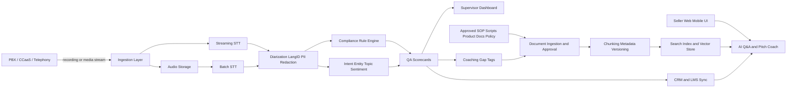
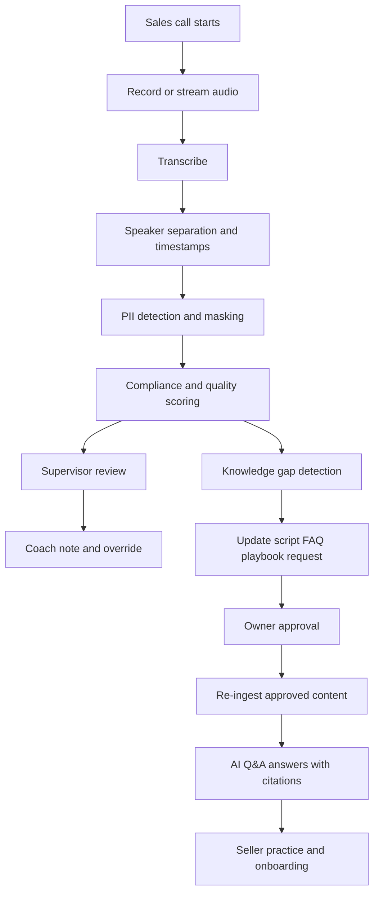

# รายงานเชิงวิเคราะห์ Sale Sync และแนวทางพัฒนาโซลูชันตรวจสอบการสนทนาทางโทรศัพท์กับ AI Q&A ภายในองค์กร

## บทสรุปผู้บริหาร

จากการทบทวนแหล่งข้อมูลสาธารณะที่เข้าถึงได้ พบว่า **SaleSync** ในบริบทที่สอดคล้องกับคำขอครั้งนี้ มีร่องรอยสาธารณะในฐานะ **แพลตฟอร์ม/สถาบันฝึกอบรมและที่ปรึกษา** ที่เริ่มเปิดตัวในบริบทของงาน Bangladesh Retail Congress และร่วมกับ BBF Academy จัดหลักสูตร **Trade Marketing Excellence** โดยมีข้อความสาธารณะระบุว่าเป็นแพลตฟอร์มที่มุ่งเชื่อมช่องว่างระหว่าง “ศักยภาพ–ผลลัพธ์” และ “ความรู้–การลงมือทำ” รวมถึงมีผู้เข้าร่วมจากหลายองค์กรในรุ่นแรก อย่างไรก็ดี **ไม่พบ product documentation ทางเทคนิคที่เพียงพอ** สำหรับยืนยันโมดูลซอฟต์แวร์, API, CTI, CRM connector, security architecture หรือข้อจำกัดเชิงระบบของ SaleSync จากแหล่งสาธารณะที่ตรวจสอบได้ในรอบนี้ จึงควรถือว่า SaleSync ณ ตอนนี้มีข้อมูลสาธารณะในมิติ “โปรแกรมฝึกอบรม” มากกว่ามิติ “แพลตฟอร์ม conversation intelligence แบบพร้อมเชื่อมระบบองค์กร” citeturn7view2turn7view3turn6search30turn5search1

ดังนั้น หากเป้าหมายขององค์กรคือการสร้าง **solution ตรวจสอบการโทร + AI Q&A สำหรับ onboarding และ coaching** แนวทางที่เหมาะสมที่สุดไม่ใช่การสมมติว่า SaleSync มีความสามารถด้าน call monitoring อยู่แล้ว แต่ควรตีโจทย์เป็นการออกแบบ **สถาปัตยกรรมแยกเป็นสองชั้น** คือ  
**ชั้นแรก** เป็นระบบ ingest/ถอดเสียง/วิเคราะห์การสนทนา/ตรวจ compliance จาก CTI หรือ CCaaS ที่องค์กรใช้จริง และ  
**ชั้นที่สอง** เป็นระบบ AI Q&A แบบ RAG ที่ตอบจากเอกสารภายในพร้อมอ้างอิงแหล่งข้อมูล เพื่อใช้ onboarding, battle cards, objection handling, product knowledge และ practice mode สำหรับเซลล์ใหม่และเซลล์เดิม citeturn32view1turn32view2turn31view1turn16search0turn37view0turn37view1

ในเชิง business problem จุดเจ็บหลักของฝ่ายขายมักไม่ได้อยู่ที่ “ขาดคอนเทนต์ฝึกอบรม” เพียงอย่างเดียว แต่เกิดจากการที่ความรู้กระจายอยู่หลายที่, onboarding ไม่สม่ำเสมอ, manual QA ตรวจได้เพียงบางส่วนของการโทร, feedback เข้าหา agent ช้า, การใช้สคริปต์และ disclosure ไม่ครบ, และเมื่อขยายทีม ปัญหาเหล่านี้ยิ่งสูงขึ้น โดยเฉพาะในสภาพแวดล้อมที่มีเสียงไทย–อังกฤษผสม สำเนียงหลากหลาย หรือมีข้อกำกับด้านข้อมูลส่วนบุคคลและการโอนข้อมูลข้ามประเทศ citeturn18search8turn18search4turn18search1turn31view0turn31view1turn21search0turn21search3turn30view0turn25view2

ข้อเสนอเชิงออกแบบของรายงานนี้จึงสรุปได้สั้น ๆ ว่า  
**ควรสร้างระบบ post-call เป็นแกนก่อน**, แล้วค่อยเพิ่ม real-time alert เฉพาะ use case ที่เสี่ยงสูง เช่น mandatory disclosure, prohibited claims, PII leakage, หรือ coaching cue ระหว่างการขายสด จากนั้นจึงต่อยอดด้วย AI Q&A ที่ตอบจากเอกสาร approved source เท่านั้น, บังคับ citation, มีสิทธิ์เข้าถึงตามบทบาท, มี evaluation set ของคำถาม onboarding และมี human review loop เพื่อให้ knowledge base พัฒนาไปพร้อมกับการใช้งานจริง citeturn32view0turn31view2turn31view0turn37view2turn38view1turn37view3turn38view0

สำหรับองค์กรที่ต้องการเริ่มเร็ว แผนที่เหมาะสมที่สุดคือ **POC 6–8 สัปดาห์** กับ 2 ทีมขาย, อย่างน้อย 3,000–5,000 สายหรือ 150–250 ชั่วโมงเสียง, และชุดคำถาม gold set สำหรับ Q&A อย่างน้อย 300–500 ข้อ โดยเกณฑ์ผ่านควรเน้น 4 เรื่องพร้อมกัน คือ **ความแม่นยำของ transcript, ความแม่นยำของ compliance flag, ความเร็วของ feedback loop, และความน่าเชื่อถือของ Q&A พร้อม citation** ไม่ใช่ดูเฉพาะ demo คุณภาพดีแต่ไม่วัดผลใน production-like setting citeturn37view2turn17search0turn17search1

## ขอบเขตและข้อจำกัดของข้อมูล

รายงานนี้ยึดหลัก **ใช้แหล่งข้อมูลทางการและงานวิจัยต้นฉบับเป็นหลัก** แต่ในกรณีของ SaleSync เอง ข้อมูลสาธารณะที่ตรวจสอบได้มีลักษณะเป็นข้อความเปิดตัว, หน้าเพจ social, และโพสต์จากผู้จัด/ผู้เข้าร่วมหลักสูตร มากกว่าจะเป็นเอกสาร product documentation ทางเทคนิค จึงทำให้การวิเคราะห์ในส่วน SaleSync ต้องแยกชัดเจนระหว่างสิ่งที่ “พบในเอกสารสาธารณะ” กับสิ่งที่ “ยังไม่ระบุ” citeturn7view2turn7view3turn6search30turn5search1

ผลที่ตามมาคือ รายงานนี้ **ไม่สามารถยืนยันได้** ว่า SaleSync มีความสามารถต่อไปนี้จริงหรือไม่จากเอกสารทางการที่เปิดเผยต่อสาธารณะ:  
การเชื่อม API, webhook, CTI softphone integration, CRM sync, SIPREC/media streaming, QA scorecards, multilingual STT, PII redaction, role-based access control, audit logging, data residency, หรือ security certifications. ในรายงานนี้ สิ่งใดที่ยังไม่พบหลักฐานสาธารณะ จะระบุเป็น **“ไม่ระบุในเอกสารสาธารณะที่ตรวจสอบได้”** แทนการคาดเดา

เพราะฉะนั้น ข้อเสนอส่วน solution architecture, requirement, KPI และ POC ในเอกสารฉบับนี้ จึงเป็น **ข้อเสนอแนะเชิงออกแบบสำหรับองค์กรผู้ใช้งานปลายทาง** ที่ต้องการสร้างระบบตรวจสอบการโทรและ AI Q&A ภายในองค์กร ไม่ใช่การรับรองว่า SaleSync มีคุณสมบัติเหล่านั้นอยู่แล้วโดยกำเนิด

## ภาพรวม Sale Sync

### สถานะของ Sale Sync จากแหล่งสาธารณะ

หลักฐานสาธารณะที่สอดคล้องกันมากที่สุดชี้ว่า SaleSync ถูกสื่อสารในฐานะ **แพลตฟอร์ม/สถาบันเพื่อยกระดับทักษะบุคลากรค้าปลีกและฝ่ายขาย** โดยเชื่อมกับ Bangladesh Brand Forum และ BBF Academy และในโพสต์เปิดตัวมีการระบุว่ารุ่นแรกของการฝึกอบรมด้าน Trade Marketing รวบรวมผู้เข้าร่วมจาก 25 องค์กร จำนวน 40 คน ขณะเดียวกันโพสต์จากผู้เข้าร่วมระบุว่าหลักสูตรให้กรอบคิดด้าน retail execution, channel development และ performance-driven trade marketing ที่นำไปใช้ได้จริง citeturn7view2turn7view3

อย่างไรก็ดี ในแหล่งสาธารณะที่ตรวจสอบได้ **ยังไม่พบหน้าเอกสารแบบ product spec หรือ developer documentation** ที่อธิบายว่า SaleSync มีองค์ประกอบเป็น SaaS platform สำหรับ conversation intelligence, call analytics, agent coaching หรือ internal knowledge assistant โดยตรง หรือมี interface สำหรับเชื่อมระบบโทรศัพท์และ CRM อย่างไร จึงไม่ควรสรุปเกินกว่าหลักฐานที่พบจริง citeturn7view2turn7view3turn6search30turn5search1

### สรุปภาพรวมเชิงผลิตภัณฑ์

| มิติ | สิ่งที่พบจากแหล่งสาธารณะ | ข้อสรุปสำหรับการวิเคราะห์ |
|---|---|---|
| Positioning | SaleSync ถูกอธิบายในบริบทของการยกระดับ talent และเปิดตัวหลักสูตร Trade Marketing ร่วมกับ BBF Academy และ Bangladesh Brand Forum citeturn7view2turn7view3turn6search30 | มองเป็น **training/capability platform** ได้ในระดับหนึ่ง |
| รูปแบบการให้บริการ | หน้า social สาธารณะของ SaleSync ระบุภาพลักษณ์เป็นสถาบันฝึกอบรมและที่ปรึกษาในภูมิภาค citeturn5search1 | มีน้ำหนักไปทาง **training + consulting** มากกว่า enterprise software ที่มี docs ครบ |
| โมดูลหลัก | **ไม่ระบุในเอกสารสาธารณะที่ตรวจสอบได้** | ต้องขอ product deck / demo / MSA เพิ่ม |
| API | **ไม่ระบุ** | ต้อง vendor due diligence |
| CTI integration | **ไม่ระบุ** | ต้องตรวจว่ารองรับ recording ingest, SIPREC, WebSocket media stream หรือไม่ |
| CRM integration | **ไม่ระบุ** | ต้องตรวจว่าเชื่อม Salesforce, HubSpot, Zoho, Dynamics ฯลฯ ได้อย่างไร |
| Security / privacy / retention | **ไม่ระบุ** | ต้องขอ security questionnaire, DPA, retention matrix |
| Analytics / QA scorecards | **ไม่ระบุ** | หากไม่มี native capability ควรออกแบบแยกจาก SaleSync |

### ข้อสรุปเชิงกลยุทธ์ต่อการตัดสินใจ

ถ้าจะใช้ SaleSync ในโครงการนี้ ควรพิจารณา SaleSync เป็นได้ 2 บทบาทที่เป็นไปได้มากกว่า  
บทบาทแรก คือ **content and enablement partner** ในการจัดทำ playbook, rubric, objection map, competency framework  
บทบาทที่สอง คือ **change management / training operations partner** สำหรับ rollout และ coaching practice

ในทางกลับกัน หากองค์กรต้องการ **ระบบ production-grade สำหรับตรวจสอบสายโทรและ AI Q&A** ควรประเมินแยกต่างหากว่า SaleSync มี technology stack รองรับจริงหรือไม่ เพราะจากหลักฐานสาธารณะในรอบนี้ **ยังไม่มีข้อมูลเพียงพอให้ถือว่า SaleSync เป็นระบบ CTI/CRM-integrated conversation intelligence platform โดยตัวมันเอง** citeturn7view2turn7view3turn5search1

## Pain points ของฝ่ายขาย

ตารางด้านล่างเป็น **การประเมินเชิงวิเคราะห์** โดยใช้ระดับ ความถี่/ความรุนแรง/ความเป็นไปได้ในการแก้ไข แบบ **สูง–กลาง–ต่ำ** อิงจากงานวิจัยด้าน onboarding และ knowledge retention, แนวทางของระบบ quality analytics ใน contact center, และข้อจำกัดที่พบในระบบ ASR/diarization และ PDPA ไม่ใช่ตัวเลข benchmark สากลตายตัวสำหรับทุกองค์กร citeturn18search8turn18search4turn18search1turn31view0turn31view1turn21search0turn21search3turn25view2

| Pain point | ผลกระทบทางธุรกิจ | ความถี่ | ความรุนแรง | ความเป็นไปได้ในการแก้ไข | หมายเหตุเชิงหลักฐาน |
|---|---|---:|---:|---:|---|
| Onboarding ไม่สม่ำเสมอ และพึ่งพา shadowing มากเกินไป | ramp-up ช้า, message ไม่คงที่, ความมั่นใจของเซลล์ใหม่ต่ำ, onboarding quality แตกต่างตามหัวหน้าทีม | สูง | สูง | สูง | งานวิจัยด้าน onboarding ชี้ว่าการ onboard ที่เป็นระบบสัมพันธ์กับการปรับตัวและ retention ที่ดีขึ้น และกรณีศึกษาด้าน sales onboarding ระบุว่าการขาด scalable process ทำให้ ramp-up ยาวนาน citeturn18search8turn18search4turn19search7 |
| ความรู้กระจัดกระจาย และ retention ต่ำ | ตอบลูกค้าไม่ตรงกัน, 回ไปถามหัวหน้าบ่อย, “tribal knowledge” ไม่ถูกส่งต่อ | สูง | สูง | สูง | งานทบทวน spacing effect ชี้ว่าการทบทวนแบบกระจายเวลาเพิ่มการคงอยู่ของความจำได้ดีกว่าการยัดเรียนครั้งเดียว จึงสนับสนุนให้มี AI Q&A + drill/rehearsal แทนการอบรมครั้งเดียวจบ citeturn18search1 |
| ตรวจคุณภาพการโทรได้เพียงบางส่วน และ feedback มาช้า | coach ไม่ทันเหตุการณ์, พลาด pattern ของข้อผิดพลาด, ผู้จัดการใช้เวลาเยอะกับการฟังย้อนหลัง | สูง | สูง | สูง | Google Quality AI และ Amazon Contact Lens ถูกออกแบบมาเพื่อวิเคราะห์ transcript, scorecard, quality score และ agent evaluation ซึ่งสะท้อนว่าการตรวจ call quality แบบอัตโนมัติเป็น use case หลักของตลาด citeturn31view0turn31view1 |
| การปฏิบัติตามสคริปต์/mandatory disclosure ไม่ครบ | เสี่ยงร้องเรียน, เสี่ยงผิดข้อกำกับ, brand risk, dispute handling ยาก | กลาง–สูง | สูงมาก | สูง | AWS ระบุชัดว่าระบบคุณภาพสามารถประเมิน criteria อย่าง script adherence, sensitive data collection และ greeting ได้ และ Call Analytics รองรับ category rules/real-time alerts citeturn31view1turn15search8turn31view2 |
| Feedback loop ระหว่าง QA, Training, Product และ Legal ไม่ปิด | ข้อผิดพลาดเกิดซ้ำ, script/knowledge base ไม่อัปเดตตามสนามจริง | สูง | สูง | สูง | Google Quality AI รองรับ scorecards และ manual updates ที่ feed กลับเป็น example conversation ได้ ซึ่งเป็น pattern ที่ดีสำหรับ closed-loop improvement citeturn31view0 |
| ขยายทีมแล้ว supervisor capacity ไม่พอ | QA coverage ลดลง, coaching ไม่ทั่วถึง, ความแปรปรวนระหว่างทีมสูง | สูง | สูง | กลาง–สูง | เมื่อ conversation volume เพิ่ม การประเมินด้วย scorecard อัตโนมัติและ search-able transcript ช่วยให้ supervisor โฟกัสเฉพาะเคสเสี่ยง/เคสสอนงานได้มากขึ้น citeturn31view0turn31view1 |
| ภาษาไทย–อังกฤษปนกัน, สำเนียงหลากหลาย, เสียงโทรศัพท์คุณภาพต่ำ | transcript error สูง, intent/entity ผิด, scoring และ compliance flag ผิดพลาดตาม | กลาง–สูง | สูง | กลาง | งานวิจัยชี้ว่า ASR ยังมี bias ตามสำเนียง/กลุ่มผู้พูด และ diarization ใน conversational telephone speech ยังเป็นโจทย์ท้าทาย โดย speaker partitioning แบบ real-time เองก็ทำงานได้ดีที่สุดกับผู้พูดประมาณ 2–5 คน citeturn21search0turn21search3turn14search5 |
| ความเป็นส่วนตัวและการคุมวงจรชีวิตข้อมูลไม่ชัด | เก็บเสียง/ถอดความเกินจำเป็น, โอนข้อมูลข้ามประเทศผิดเงื่อนไข, breach impact สูง | สูง | สูงมาก | กลาง | PDPA กำหนดเรื่อง lawful basis, retention, deletion, security measures, breach notification และ cross-border transfer อย่างชัดเจน จึงต้องออกแบบ governance ตั้งแต่ day one citeturn25view0turn25view1turn25view2turn30view0 |

### นัยสำคัญเชิงออกแบบ

หากมอง pain points ทั้งหมดรวมกัน จะเห็นว่าสิ่งที่องค์กรต้องแก้ไม่ใช่ “แค่มี transcript” แต่ต้องมี **ระบบที่เปลี่ยน transcript ให้กลายเป็น coaching signal และ knowledge signal** กล่าวคือ  
การโทรผิดพลาดหนึ่งครั้งต้องนำไปสู่ 3 อย่างพร้อมกัน:  
การแจ้งเตือนหรือให้คะแนนในสาย, การโค้ช agent หลังสาย, และการอัปเดต knowledge base หรือ playbook เพื่อไม่ให้เกิดซ้ำในสายถัดไป citeturn31view0turn31view1

## ข้อกำหนดระบบตรวจสอบการโทร

### หลักการออกแบบ

ระบบตรวจสอบการโทรที่เหมาะกับทีมขายควรแยก **สามชั้นความสามารถ** ให้ชัดเจน คือ  
**capture layer** สำหรับรับเสียงและ metadata,  
**analysis layer** สำหรับ STT/diarization/analytics/rules, และ  
**action layer** สำหรับ scorecards, QA review, alerting, coaching, CRM sync และ data governance.  
แนวทางนี้สอดคล้องกับ pattern ของผู้ให้บริการอย่าง Twilio ที่เปิด raw audio ผ่าน WebSocket, Amazon Connect ที่แยก flow recording behavior ออกจาก analytics, และ Salesforce ที่แยก telephony integration ออกจาก CRM workflow เอง citeturn32view1turn32view2turn11search1turn11search7

### รายการข้อกำหนดเชิงเทคนิคและฟังก์ชันตามลำดับความสำคัญ

| ลำดับความสำคัญ | ข้อกำหนด | รายละเอียดที่แนะนำ |
|---|---|---|
| P0 | การรับเสียงจากระบบโทรศัพท์ | รองรับอย่างน้อย 2 แบบ: **post-call recording ingest** และ **real-time media stream** จาก PBX/CCaaS/softphone; กรณี Twilio สามารถใช้ Media Streams ส่ง raw audio ผ่าน WebSocket ได้ และกรณี Amazon Connect สามารถตั้งพฤติกรรม recording ผ่าน flow block ได้ citeturn32view1turn32view2 |
| P0 | การเชื่อม agent/call context | ทุกสายต้องผูกกับ agent ID, queue, campaign, lead/opportunity/account ID, product, language, timestamp และ disposition เพื่อให้ downstream analytics ใช้ได้จริง |
| P0 | รองรับภาษาไทยและอังกฤษ | ผู้ให้บริการ cloud หลักรองรับไทยและอังกฤษ แต่ feature ไม่เท่ากันทุกภาษา: Google STT รองรับ `th-TH` และ `en-US` โดยภาษาอังกฤษมี telephony model ชัดเจน; Amazon Transcribe รองรับ `th-TH` แบบ batch/streaming; Azure Speech รองรับ real-time/fast/batch transcription และมี `th-TH` ในตารางภาษา citeturn34view0turn34view5turn34view1turn32view0turn35view1 |
| P0 | speaker diarization / dual-channel support | ต้องแยกบทพูดลูกค้า–เซลล์ให้ได้ด้วยความแม่นยำพอสำหรับ scoring; Google และ Azure มี diarization; AWS รองรับ speaker partitioning ทั้ง batch และ streaming แต่ real-time เหมาะที่สุดกับ 2–5 speakers citeturn14search2turn14search0turn14search1turn14search5 |
| P0 | custom vocabulary / model adaptation | ต้องมี dictionary สำหรับ product names, competitor names, jargon, โปรโมชั่น, ชื่อ campaign และ mandatory disclaimer เพื่อเพิ่มความแม่นยำของ transcript โดย Google ระบุ model adaptation ช่วย bias คำเฉพาะทางให้รู้จำได้ดีขึ้น และ AWS Call Analytics รองรับ custom vocabularies / language models citeturn13search3turn31view2 |
| P0 | transcript schema ที่นำไปใช้ต่อได้ | ต้องเก็บ word timestamps, speaker labels, sentiment/issue flags, rule hits, language tags, confidence, recording URI และ redaction markers |
| P0 | rule engine สำหรับ compliance | ต้องรองรับทั้ง **keyword/phrase rule**, **semantic rule**, **required sequence**, และ **negative rule** เช่น “ห้ามอ้าง benefit เกินจริง”, “ต้องกล่าว disclosure ภายในช่วงต้นสาย”, “ถ้ากล่าวราคา ต้องกล่าวเงื่อนไขประกอบ” โดย AWS Call Analytics categories รองรับ rule objects ที่ใช้ transcript, sentiment, interruption และ non-talk time ได้ citeturn15search8turn31view2 |
| P0 | scoring และ evidence | QA score ต้อง trace ย้อนกลับได้ว่าได้คะแนนเพราะ utterance ไหน ตรงกับ rubric ข้อใด; Google Quality AI และ Amazon Contact Lens ต่างใช้ scorecard/evaluation form เป็นแกนของ quality evaluation citeturn31view0turn31view1 |
| P0 | security, PII handling, retention | ต้องมี PII detection/redaction, encryption at rest/in transit, audit trail, RBAC และ retention policy แยกเสียง–transcript–summary–feature store; PDPA กำหนดให้มี security measures, retention/deletion controls และ breach notification; AWS/Azure รองรับ PII redaction สำหรับ transcript/call workflows โดยตรง citeturn25view2turn25view4turn26search0turn26search4turn26search2turn27search9 |
| P1 | real-time alerting | ใช้สำหรับ high-risk moments เช่น missing disclosure, banned phrase, PII exposure, escalation cue โดย Twilio media streaming และ AWS real-time call analytics รองรับ use case แบบใกล้ real time ได้ citeturn32view1turn31view2 |
| P1 | post-call analytics เชิงลึก | ใช้สำหรับ score, trend, coaching, issue/outcome extraction, sentiment over time, topic mining ซึ่งมักคุ้มต้นทุนและควบคุม false positive ง่ายกว่า real-time อย่างเต็มรูปแบบ citeturn15search0turn31view1turn31view0 |
| P1 | reviewer override และ calibration | ต้องให้ QA manager แก้ score/label และใช้ผล correction ทำ model/rule recalibration อย่างมี governance |
| P1 | CRM/CTI integration | ถ้าใช้ Salesforce ควรระวังว่า **Open CTI อยู่ใน maintenance mode และ scheduled retirement ในก.พ. 2028**; connector ใหม่ควรเผื่อใช้ Service Cloud Voice/partner telephony/BYOC หรือ telephony integration API มากกว่าออกแบบใหม่บน Open CTI อย่างเดียว citeturn10search7turn11search1turn11search7turn11search14 |
| P2 | coaching copilot / next-best-action | สร้าง nudges และ suggested phrasing ระหว่างหรือหลังสาย เมื่อ P0 และ P1 เสถียรแล้ว |
| P2 | multi-model fallback | สำหรับไทย–อังกฤษปนกันหรือสำเนียงเฉพาะ อาจใช้ model routing/fallback strategy หาก single ASR ไม่พอ |

### real-time กับ post-call ควรเลือกอย่างไร

| ทางเลือก | เหมาะเมื่อ | ข้อดี | ข้อควรระวัง |
|---|---|---|---|
| Post-call before real-time | เริ่มต้นโครงการ, ต้องการ quick win, ยังไม่มี gold labels มาก | คุมต้นทุนง่าย, ปรับ rule และ scorecard ง่าย, ลด false positive ต่อ agent | feedback ไม่ทันระหว่างสาย |
| Selective real-time | ใช้กับ disclosure สำคัญ, PII alert, coaching cue ที่มี cost of miss สูง | สร้างผลลัพธ์ทาง compliance และ coaching เร็ว | ต้องคุม latency และ alert fatigue |
| Full real-time agent assist | ทีมขาย volume สูง, playbook คงที่, transcript quality สูงแล้ว | เพิ่ม adherence และ coaching in the moment | ซับซ้อนที่สุดทั้ง integration, latency, trust, change management |

ข้อเสนอเชิงปฏิบัติคือ **เริ่มแบบ post-call เป็น baseline** แล้วเพิ่ม real-time เฉพาะ **critical moments** ก่อน เพราะผู้ให้บริการหลักรองรับทั้ง streaming และ batch อยู่แล้ว แต่ภาระในการทำ alert ที่ “เชื่อถือได้พอให้ agent ใช้จริง” สูงกว่าการทำ transcript และ score หลังสายมาก citeturn32view0turn32view1turn31view2

### non-functional requirements ที่ไม่ควรละเลย

เป้าหมายเชิงสถาปัตยกรรมที่แนะนำมีดังนี้  
latency ของ partial transcript ใน real-time ควรอยู่ในระดับ **ไม่รบกวน agent** และ critical alert ควรเร็วพอสำหรับนำไปใช้กลางสาย;  
ระบบต้องรองรับ **retention ตาม policy ไม่ใช่เก็บถาวรโดยปริยาย**;  
ต้องมี **default deny access** และ least privilege ตามหลัก NIST;  
และต้องกำหนดล่วงหน้าว่า provider ใดจะเห็นข้อมูลเสียง/ข้อความบ้าง รวมถึง data logging behavior ของผู้ให้บริการ ตัวอย่างเช่น Google Cloud ระบุว่า **ค่าเริ่มต้น Cloud Speech-to-Text จะไม่ log audio/transcript ของลูกค้า** เว้นแต่ลูกค้าจะ opt in เข้าร่วม data logging program เอง citeturn38view0turn27search1turn36search3

## ข้อกำหนดระบบ AI Q&A ภายในองค์กร

### บทบาทของระบบ AI Q&A ในงาน onboarding

AI Q&A สำหรับทีมขายไม่ควรเป็นเพียง “chatbot ตอบคำถาม” แต่ควรเป็น **knowledge layer กลางของทีมขาย** ที่ตอบจากเอกสารภายในที่อนุมัติแล้ว พร้อม citation และบริบทการใช้งาน เช่น สายการขายแบบ inbound/outbound, product line, region, pricing version, script policy และข้อกฎหมายที่เกี่ยวข้องกับแต่ละประเทศหรือแต่ละธุรกิจ การใช้แนวทาง Retrieval-Augmented Generation มีเหตุผลเชิงวิจัยชัดเจน เพราะ RAG ลดการพึ่งความรู้จากพารามิเตอร์ล้วน และเพิ่มความสามารถในการอ้างอิงความรู้ที่อัปเดตได้ภายนอกโมเดล citeturn16search0turn37view0

### ข้อกำหนดหลักของระบบ

| หัวข้อ | สิ่งที่ระบบต้องมี | ข้อเสนอแนะ |
|---|---|---|
| Knowledge sources | SOP, product sheets, pricing books, battle cards, scripts, legal disclosure, FAQ, LMS modules, best-call exemplars, objection handling playbooks | ให้ทุกเอกสารมี owner, version, effective date, region/language tags |
| Update workflow | draft → review → approve → ingest → test → publish | ต้องมี human approval gate ก่อนเข้า production |
| Retrieval strategy | semantic search + metadata filter + role/language filter | ควรค้นหาได้ตาม product, persona, country, ฝ่ายขาย/BDR/AE/CSM, และเวลาใช้บังคับ |
| Answer policy | ตอบพร้อม citation เสมอ, ถ้าไม่พบข้อมูลต้องตอบว่า “ไม่พบในแหล่งที่อนุมัติ” | ห้ามเดาเมื่อเป็นเรื่อง policy/price/legal |
| Guardrails | access control, source allowlist, prompt injection defense, PII masking, tool restrictions | ต้องถือว่า retrieved files และ user pasted content อาจไม่ trusted ทั้งหมด citeturn38view1turn37view4turn37view3 |
| Evaluation | faithfulness, answer relevance, citation correctness, abstention quality, latency, escalation rate | ควรมี gold set และ regression eval ทุกครั้งที่เปลี่ยน ingestion/model/prompt citeturn37view2turn17search0turn17search1 |
| UX สำหรับ sales onboarding | quick answer, source preview, “พูดอย่างไร / ห้ามพูดอย่างไร”, roleplay, practice drill, pitch critique | UI ต้องช่วย “ฝึกใช้งาน” ไม่ใช่ตอบอย่างเดียว |

### RAG ที่เหมาะกับโจทย์นี้ควรหน้าตาอย่างไร

สำหรับ onboarding และ internal Q&A แนวทางที่เหมาะที่สุดคือ **approved-source RAG** มากกว่า open-web style agent กล่าวคือ ระบบควรตอบจากฐานความรู้ภายในที่ผ่านการอนุมัติแล้ว และแสดงที่มาของคำตอบทุกครั้ง OpenAI อธิบายแนวทาง knowledge retrieval ว่าช่วยสร้าง assistant ที่ให้คำตอบเชื่อถือได้จากข้อมูลขององค์กร และ starter kit ของ OpenAI เองก็เน้นว่า answer ควรถูก grounding ด้วย citations ที่ย้อนกลับไปยังเอกสารต้นทางได้ citeturn37view0turn37view1

ในเชิงวิจัย RAG และ Self-RAG สนับสนุนแนวคิดว่าการ retrieve ข้อมูลที่เกี่ยวข้องและการสะท้อนคุณภาพคำตอบช่วยเพิ่ม factuality และคุณภาพของคำตอบสำหรับงาน knowledge-intensive ได้ดีกว่าใช้โมเดลแบบไม่มี retrieval layer เพียงอย่างเดียว citeturn16search0turn16search1

### วิธีอัปเดตความรู้ให้ทันธุรกิจจริง

workflow ที่แนะนำมีลักษณะดังนี้  
**เจ้าของเอกสาร** ส่ง revision → **review โดย training/legal/product owner** → **ingest พร้อม metadata** → **run smoke eval** บนชุดคำถามที่เกี่ยวข้อง → **publish** ไปยัง production index → บันทึก changelog ว่าคำถามลูกค้า/agent แบบใดจะได้รับผลกระทบ

จุดสำคัญคือทุกครั้งที่มีการเปลี่ยน price book, promotion, product limitation, script, หรือ legal disclosure ต้องไม่เปลี่ยนเฉพาะ PDF แต่ต้องมี **eval rerun** ด้วย OpenAI ระบุไว้ชัดว่าการทำ eval คือวิธีหลักในการวัด accuracy, reliability และใช้เพื่อ iterate ระบบ AI ใน production ส่วนงานวิจัยอย่าง RAGAS และ ARES แยกมิติของการประเมินเป็นอย่างน้อย **context relevance, answer faithfulness, answer relevance** ซึ่งเหมาะกับระบบ onboarding Q&A อย่างมาก citeturn37view2turn17search0turn17search1

### Guardrails ที่จำเป็น

ระบบประเภทนี้ต้องสมมติว่า prompt injection เป็นความเสี่ยงจริง โดยเฉพาะเมื่อผู้ใช้ paste อีเมลลูกค้า, competitor docs, หรือไฟล์ภายนอกเข้ามา OpenAI และ OWASP ต่างชี้ว่าการโจมตีแบบ prompt injection ยังเป็นปัญหายากและไม่ถูกแก้ได้สมบูรณ์ด้วย RAG เพียงอย่างเดียว ดังนั้น guardrail ขั้นต่ำควรมีดังนี้:  
การจำกัด input length และ input type, การ whitelist เฉพาะ source ที่เชื่อถือได้, การแยก trusted instruction ออกจาก untrusted context, การไม่ให้ตัว agent ส่งข้อมูลออกภายนอกโดยอัตโนมัติ, การบังคับ human confirmation ก่อน action สำคัญ, และการใช้ least privilege สำหรับทุก connector และ API key citeturn37view3turn37view4turn37view5turn38view1turn38view0

### รูปแบบ UI/UX ที่ควรมีสำหรับเซลล์ฝึกนำเสนอ

หน้าจอที่เหมาะสำหรับทีมขายควรประกอบด้วย 5 โหมดการใช้งานหลัก

โหมดแรกคือ **Ask** สำหรับถามตอบเร็ว พร้อม citation  
โหมดที่สองคือ **Pitch Coach** ให้ agent ส่งสคริปต์หรืออัดเสียง แล้วระบบช่วย critique ว่าครบ value proposition, discovery question, objection handling และ disclosure หรือไม่  
โหมดที่สามคือ **Roleplay** ให้จำลองลูกค้าตาม persona  
โหมดที่สี่คือ **Flash Drill** สำหรับทบทวน key facts แบบ spaced repetition  
และโหมดที่ห้าคือ **What changed** เพื่อบอกว่าเอกสาร/ราคา/ข้อกำกับใดเพิ่งเปลี่ยน

เหตุผลที่ควรมีโหมดเหล่านี้ ไม่ใช่เพียงเพื่อ usability แต่เพื่อให้ระบบทำหน้าที่เชื่อมระหว่าง **knowledge retrieval**, **onboarding reinforcement** และ **performance coaching** อย่างต่อเนื่อง แทนการใช้ chatbot แบบตอบเป็นครั้ง ๆ แล้วจบ citeturn18search1turn31view0

## สถาปัตยกรรมแนะนำและทางเลือกการนำไปใช้

### สถาปัตยกรรมแนะนำ

แนวทางที่แนะนำคือแยก **call monitoring** และ **internal knowledge/Q&A** ออกจากกันในเชิงระบบ แต่เชื่อมกันผ่าน metadata, scorecard tags, knowledge gaps และ coaching feedback วิธีนี้ทำให้ทีมสามารถเริ่มจาก post-call quality monitoring ได้เร็ว ขณะเดียวกันก็ป้อน insight จากสายจริงกลับไปปรับ knowledge base และ onboarding content เป็นวงจรปิด citeturn31view0turn31view1turn37view1

สถาปัตยกรรมนี้สอดคล้องกับความสามารถของตลาดที่มีอยู่จริง: Twilio รองรับ streaming audio ผ่าน WebSocket; Amazon Connect รองรับ recording behavior และการหยุด/ต่อ recording ตอนเก็บข้อมูลอ่อนไหว; Google/AWS/Azure รองรับ STT, diarization หรือ conversation analytics ในหลายระดับ; และระบบ knowledge retrieval สมัยใหม่รองรับ ingestion, retrieval และ eval เป็น pipeline แยกจาก call capture ได้ citeturn32view1turn32view2turn32view3turn31view2turn37view1

### Workflow ของการตรวจสอบการโทรและ Q&A

จุดที่สำคัญที่สุดของ workflow นี้คือ **knowledge gap detection**: ถ้าระบบพบว่าทีมขายพลาดเรื่องเดิมซ้ำ ๆ เช่น ลืม qualification question, ตอบเรื่องราคาไม่ครบ, หรือสื่อสารเงื่อนไขโปรโมชันผิด ข้อมูลนั้นต้องถูกผลักกลับไปสู่ owner ของ script/FAQ/playbook และเมื่อ approved แล้วจึง re-ingest เข้าสู่ AI Q&A เพื่อแก้ปัญหาที่ต้นตอ ไม่ใช่แก้เฉพาะ agent รายคน citeturn31view0turn31view1

### ทางเลือกหลายระดับ

| ระดับ | องค์ประกอบ | เหมาะกับองค์กรแบบใด |
|---|---|---|
| เบื้องต้น | post-call recording ingest, batch STT ไทย/อังกฤษ, basic scorecards, searchable transcript, internal AI Q&A จากเอกสาร approved | ต้องการ quick win ภายใน 1 ไตรมาส |
| มาตรฐาน | เพิ่ม diarization, PII redaction, CRM sync, compliance rule engine, coaching dashboard, eval set ของ Q&A | ทีมขายหลายทีม เริ่มมีข้อกำกับชัด และต้องการ coaching loop |
| ขั้นสูง | เพิ่ม selective real-time alert, roleplay/pitch coach, multi-model fallback, automated calibration pipeline, multilingual governance | volume สูง, quality/compliance เป็น mission-critical, ต้องการ scale ข้าม BU/ประเทศ |

คำแนะนำคืออย่ากระโดดไปสู่ระดับขั้นสูงทันที หากยังไม่มี **gold labels**, **approved knowledge sources**, และ **owner ของ scorecards/policies** เพราะองค์ประกอบเหล่านี้สำคัญกว่าการเลือกโมเดลเสียอีก

## KPIs แผน POC ความเสี่ยง และแหล่งข้อมูล

### ตัวชี้วัดความสำเร็จ

KPIs ที่ควรใช้ต้องครอบคลุมทั้งชั้น **transcription**, **analytics/compliance**, และ **knowledge enablement** ไม่ใช่ดูเพียง accuracy ของ STT อย่างเดียว

| กลุ่ม KPI | ตัวชี้วัดที่แนะนำ | เกณฑ์ผ่านสำหรับ POC |
|---|---|---|
| Transcript quality | WER ภาษาไทย, WER ภาษาอังกฤษ, WER สายไทย–อังกฤษปน, DER สำหรับ 2-speaker calls | ตั้ง baseline จริงในสัปดาห์แรก แล้วกำหนด threshold ตามความเสี่ยงของ use case |
| Coverage | % สายที่วิเคราะห์ได้ครบ, % สายที่ผูกกับ CRM context ได้ | อย่างน้อย 90% ของสายที่อยู่ใน scope |
| Compliance | precision / recall ของ rule hits, false positive per 100 calls, median time-to-alert | recall สูงสำหรับ rule เสี่ยงสูง และ false positive ต้องไม่ทำให้ agent เลิกเชื่อระบบ |
| QA operations | median time จาก call end → score available, % สายที่ supervisor ต้อง override | ยิ่งลด override ได้เร็ว ยิ่งสะท้อนว่าระบบเริ่มเสถียร |
| Coaching impact | script adherence, disclosure completion rate, objection handling score | ต้องดีขึ้นจาก baseline อย่างมีนัยปฏิบัติ |
| Onboarding enablement | deflection rate ของ Q&A, first-response usefulness, citation correctness, faithfulness score | citation correctness สูงมาก และคำตอบต้องกล้ายอมรับว่า “ไม่พบข้อมูล” เมื่อไม่มี source |
| Adoption | weekly active reps, repeated use per rep, % managers ที่ใช้ dashboard จริง | ต้องมีสัญญาณ adoption จากทั้ง rep และ manager |

OpenAI ระบุว่า eval ที่ดีควรเริ่มจากการกำหนด objective, รวบรวม dataset, นิยาม metric และวนรอบเปรียบเทียบผล ส่วน RAGAS และ ARES เพิ่มมิติการประเมินที่เจาะกับระบบ Q&A/RAG โดยตรง เช่น context relevance และ answer faithfulness ซึ่งควรถูกนำมาใช้เป็น KPI ทางเทคนิคหลักของ AI Q&A ในโครงการนี้ citeturn37view2turn17search0turn17search1

### แผนการทดลองและ POC

ข้อเสนอ POC ที่เหมาะสมสำหรับโครงการนี้คือ **6–8 สัปดาห์** แบ่งเป็น 4 ระยะ

ระยะแรกเป็น **data readiness** 1–2 สัปดาห์ เพื่อเชื่อม recording source, คัด sample, ทำ consent notice, ออกแบบ schema, นิยาม scorecard และรวบรวม approved documents

ระยะที่สองเป็น **model/rule tuning** 2 สัปดาห์ เพื่อเลือก STT stack, ทำ vocabulary adaptation, สร้าง compliance rules, และทำ gold labeling

ระยะที่สามเป็น **pilot in production-like workflow** 2–3 สัปดาห์ ให้ supervisor ใช้ dashboard จริง, agent ใช้ Q&A จริง, และเก็บ override / failure cases

ระยะที่สี่เป็น **decision gate** 1 สัปดาห์ เพื่อเทียบ baseline กับผล pilot และตัดสินใจว่าจะขยายเป็น standard rollout หรือยังต้องทำ remediation ก่อน

ขนาดตัวอย่างที่แนะนำมีดังนี้  
อย่างน้อย **20–40 sales reps**,  
อย่างน้อย **3,000–5,000 calls** หรือ **150–250 ชั่วโมงเสียง**,  
อย่างน้อย **300 สายที่มี human labels** สำหรับ scoring/compliance calibration,  
และอย่างน้อย **300–500 onboarding Q&A questions** ที่จัดเป็น gold set แยกตาม role/product/language

POC ควรถือว่าผ่าน เมื่อครบเงื่อนไข 3 กลุ่มพร้อมกัน  
กลุ่มแรก transcript quality ถึงระดับที่ rule engine ใช้งานได้จริง,  
กลุ่มที่สอง compliance/QA workflow ลดเวลาการตรวจและเพิ่มความครอบคลุมอย่างชัดเจน,  
กลุ่มที่สาม AI Q&A ให้คำตอบพร้อม citation อย่างสม่ำเสมอและไม่ hallucinate policy/price สำคัญเกินเกณฑ์ที่ยอมรับได้

### ความเสี่ยงด้านกฎหมายและความเป็นส่วนตัว

> ส่วนนี้เป็นการสรุปเชิงปฏิบัติ ไม่ใช่คำแนะนำทางกฎหมายเฉพาะกรณี หากองค์กรอยู่ในอุตสาหกรรม regulated สูง ควรให้ legal counsel ตรวจอีกชั้น

| ประเด็นเสี่ยง | ความหมายต่อโครงการ | แนวทางปฏิบัติที่ดีที่สุด |
|---|---|---|
| Lawful basis และ notice | PDPA กำหนดว่าการเก็บ ใช้ เปิดเผยข้อมูลส่วนบุคคลต้องมีฐานทางกฎหมาย และเมื่ออาศัย consent ต้องอธิบาย purpose ชัดเจน; มาตรา 23 ยังบังคับให้แจ้ง retention period และสิทธิของเจ้าของข้อมูลด้วย citeturn25view0turn25view1 | แจ้ง call recording/analysis notice ให้ชัด, แยก purpose “quality/compliance/training”, และบันทึก lawful basis ต่อ flow |
| Data minimization | PDPA กำหนดให้การเก็บข้อมูลจำกัดเท่าที่จำเป็นต่อ lawful purpose citeturn29view1 | อย่าเก็บทุก field ถ้าไม่จำเป็นต่อ QA/coaching; แยก raw audio กับ derived features |
| Security measures | มาตรา 37 กำหนดให้มีมาตรการป้องกันการเข้าถึง สูญหาย ใช้ แก้ไข เปิดเผยโดยมิชอบ และต้องทบทวนเมื่อเทคโนโลยีเปลี่ยน citeturn25view2 | encryption at rest/in transit, audit log, RBAC, secret rotation, segregated environments |
| Retention / deletion | PDPA กำหนดให้แจ้ง retention period และมีระบบลบ/ทำลายข้อมูลเมื่อหมดความจำเป็นหรือเมื่อสิทธิของเจ้าของข้อมูลเข้ามาเกี่ยวข้อง citeturn25view1turn25view2turn25view4 | กำหนด retention matrix แยก audio / transcript / summary / score / embeddings และมี automatic TTL |
| Breach notification | มาตรา 37 กล่าวถึงการแจ้ง Office โดยไม่ชักช้า และถ้าเสี่ยงสูงต้องแจ้งเจ้าของข้อมูลด้วย citeturn25view2 | ทำ incident playbook สำหรับ transcript leak, misrouted recording, wrong access grants |
| Sensitive data | transcript หรือ audio อาจมีข้อมูลอ่อนไหวและข้อมูลการชำระเงิน; AWS และ Azure ต่างมี PII redaction สำหรับ transcript/conversation workflows citeturn26search0turn26search4turn26search2 | ใช้ PII redaction, แยก access ของ raw audio, และ pause/resume recording ตอนเก็บข้อมูลอ่อนไหว |
| Pause/resume ระหว่างเก็บข้อมูลสำคัญ | Amazon Connect ระบุชัดว่ามี Suspend/Resume recording และยกตัวอย่างการเก็บเลขบัตรเครดิต citeturn32view3turn26search7 | หากมี payment/authentication flows ต้องรองรับ pause/resume เสมอ |
| Cross-border transfer | PDPA มาตรา 28–29 กำหนดให้ปลายทางต้องมีมาตรฐานที่เพียงพอ หรือมีมาตรการคุ้มครอง/กลไกในเครือที่ผ่านการรับรอง citeturn30view0 | เลือก region ให้ชัด, ระบุ subprocessors, ตรวจ DPA/SCC/BCR หรือ equivalent safeguards |
| Least privilege | NIST ให้นิยาม least privilege ว่าควรให้สิทธิ์เท่าที่จำเป็นต่อภารกิจเท่านั้น citeturn38view0 | จำกัดสิทธิ์แบบ role-based: rep เห็นเฉพาะสายตนเอง, manager เห็นเฉพาะทีม, legal/compliance เห็นเฉพาะเคสที่จำเป็น |
| Prompt injection และ data leakage ใน Q&A | OWASP และ OpenAI ระบุว่าระบบ LLM ยังเสี่ยงต่อ prompt injection และ RAG ไม่ได้กำจัดความเสี่ยงนี้โดยสิ้นเชิง citeturn38view1turn37view4 | trusted source allowlist, sandboxing, no auto-action, human confirmation, validate user input, source-level ACL |

### ข้อเสนอเชิงสัญญาและการจัดซื้อ

ก่อนตัดสินใจใช้ SaleSync หรือ vendor ใดเป็นแกนของโครงการนี้ ควรขอเอกสารอย่างน้อยดังต่อไปนี้:  
DPA/Privacy terms, security questionnaire, data retention matrix, subprocessor list, region support, API docs, webhook/event schema, CTI/CRM integration docs, audit logging behavior, deletion/export process, และ reference architecture สำหรับ enterprise deployment การขอเอกสารเหล่านี้สำคัญมากในกรณีของ SaleSync เพราะข้อมูลสาธารณะที่ตรวจสอบได้ในรอบนี้ยังไม่เพียงพอสำหรับประเมิน maturity ทางเทคโนโลยี

### คำถามเปิดและข้อจำกัด

- ยังไม่มีเอกสารสาธารณะที่ยืนยันว่า SaleSync มี **API/CTI/CRM** integration จริงในระดับ production
- ยังไม่ทราบว่าองค์กรผู้ใช้งานเป้าหมายอยู่บน **PBX/CCaaS/CRM** ใด  
- ยังไม่ทราบข้อกำกับเฉพาะอุตสาหกรรม เช่น การเงิน ประกัน สุขภาพ หรือโทรคมนาคม  
- ยังไม่ระบุขนาดทีม, call volume, retention policy ภายใน, และข้อกำหนด data residency  
- ยังไม่ทราบว่าต้องการ **monitor ฝ่ายขายอย่างเดียว** หรือรวมทีม service/call center ด้วย

### แหล่งข้อมูลหลักที่ใช้

**ข้อมูลสาธารณะเกี่ยวกับ SaleSync**  
โพสต์เปิดตัวและบริบทการใช้งานของ SaleSync รวมถึงหลักสูตร Trade Marketing Excellence และความร่วมมือกับ BBF Academy / Bangladesh Brand Forum citeturn7view2turn7view3turn6search30turn5search1

**เอกสารทางการด้าน telephony, recording, analytics และ CRM integration**  
Twilio Media Streams สำหรับ raw audio streaming แบบ WebSocket citeturn32view1  
Amazon Connect recording behavior และการหยุด/ต่อการอัดเสียง citeturn32view2turn32view3turn26search7  
Amazon Connect Contact Lens และ Amazon Transcribe Call Analytics สำหรับ quality, sentiment, PII, category events และ compliance-oriented analytics citeturn31view1turn31view2turn15search8  
Salesforce Open CTI / Service Cloud Voice / BYOC docs สำหรับแนวทางเชื่อม telephony กับ CRM และข้อเท็จจริงเรื่อง Open CTI maintenance mode citeturn10search7turn11search1turn11search7turn11search14

**เอกสารทางการด้าน speech และ language support**  
Google Cloud Speech-to-Text language support, diarization, model adaptation, data logging และ audit logging citeturn33view0turn34view0turn34view5turn14search2turn13search3turn27search1turn27search4  
Amazon Transcribe language support, Thai streaming support, diarization และ PII redaction citeturn33view1turn12search4turn14search1turn14search5turn26search0turn26search4  
Azure Speech real-time/batch transcription, diarization, conversation PII และ privacy/security docs citeturn32view0turn14search0turn26search2turn27search9

**งานวิจัยต้นฉบับด้าน RAG, evaluation และ speech bias**  
RAG และ Self-RAG citeturn16search0turn16search1  
RAGAS และ ARES สำหรับการประเมินระบบ RAG/Q&A citeturn17search0turn17search1  
งานวิจัยเรื่อง dialect/gender bias และข้อจำกัดของ diarization ใน conversational telephone speech citeturn21search0turn21search3

**กฎหมายและแนวปฏิบัติด้านข้อมูลส่วนบุคคล**  
PDPA ภาษาอังกฤษและข้อความมาตราที่เกี่ยวกับ consent, lawful basis, retention, security และ cross-border transfer citeturn25view0turn25view1turn25view2turn30view0  
NIST least privilege glossary citeturn38view0  
OWASP และ OpenAI guidance เกี่ยวกับ prompt injection และ AI safety best practices citeturn38view1turn37view3turn37view4turn37view5

### ข้อสรุปสุดท้าย

หากสรุปในเชิงตัดสินใจธุรกิจ รายงานนี้ชี้ไปที่ข้อสรุปเดียวที่ชัดที่สุดคือ

**SaleSync ในข้อมูลสาธารณะที่ตรวจสอบได้ปัจจุบัน ดูมีน้ำหนักเป็น training/enablement platform มากกว่าระบบ call monitoring enterprise ที่มี technical documentation ครบ** ดังนั้น ถ้าเป้าหมายขององค์กรคือการสร้างโซลูชันตรวจสอบการโทรและ AI Q&A ภายในอย่างจริงจัง ควรแยกเรื่อง “training content partner” ออกจาก “technology platform of record” ให้ชัดเจน

แนวทางที่คุ้มค่าที่สุดคือ  
เริ่มจาก **post-call analytics + approved-source AI Q&A**,  
สร้าง **scorecards + knowledge base governance + eval loop** ให้แน่น,  
แล้วค่อยเพิ่ม **selective real-time alert** เมื่อ transcript quality, rule precision และ adoption ผ่านเกณฑ์จริงแล้ว

ถ้าทำตามลำดับนี้ องค์กรจะได้ทั้งผลลัพธ์ระยะสั้นด้าน QA/coaching และฐานรากระยะยาวสำหรับ onboarding, compliance และ sales enablement ในระบบเดียวกัน citeturn31view0turn31view1turn37view2turn38view1