# API Sequence Diagrams

เอกสารนี้แสดง sequence diagram ของ API หลักใน MVP โดยใช้ Rust + Actix Web เป็น backend

## 0. Quality Review Batch Flow

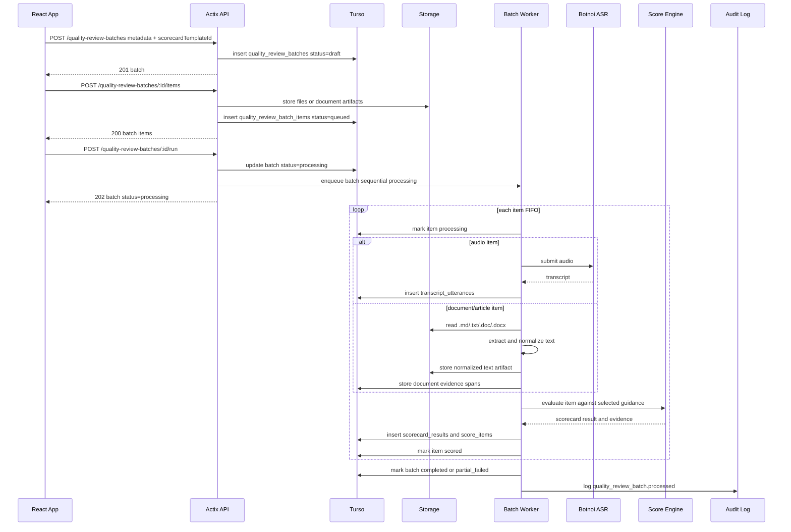

## 0.1 Recording Review Batch Flow

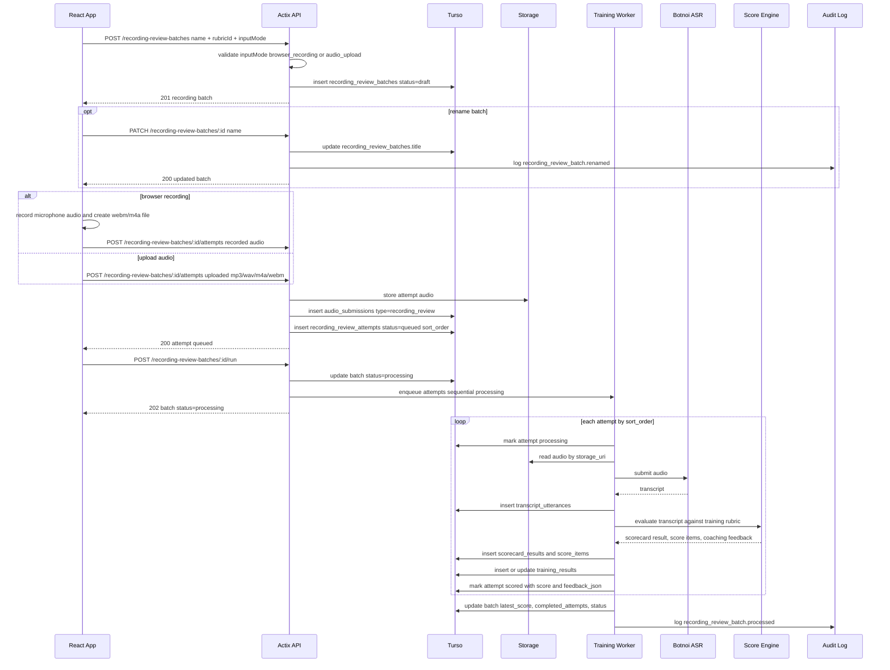

## 0.2 Recording Review Attempt ASR Review Flow

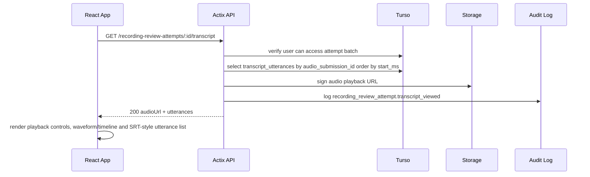

## 1. `POST /audio-submissions`

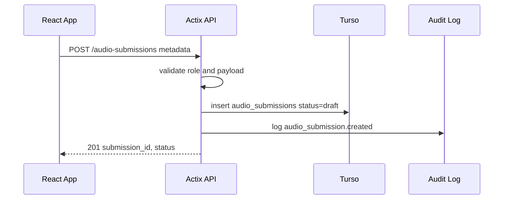

## 2. `POST /audio-submissions/:id/file`

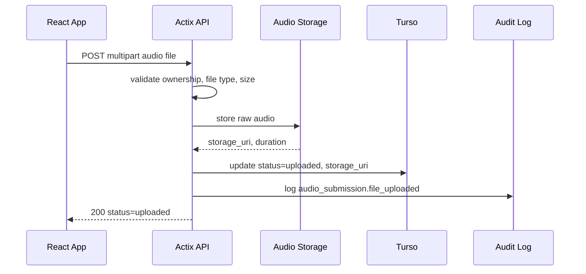

## 3. `POST /audio-submissions/:id/process`

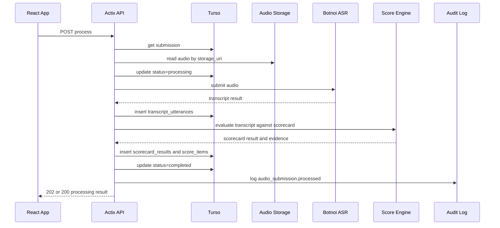

## 4. `GET /audio-submissions/:id`

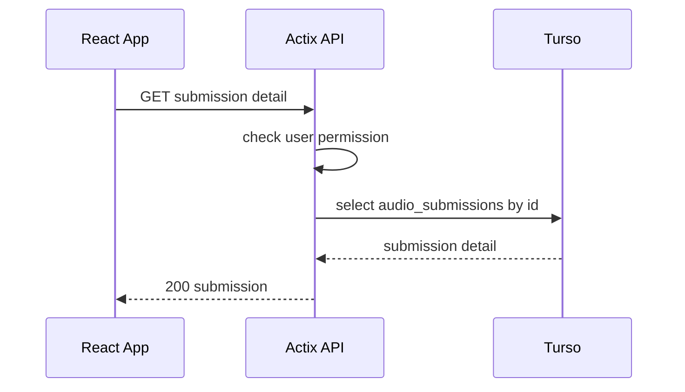

## 5. `GET /audio-submissions/:id/transcript`

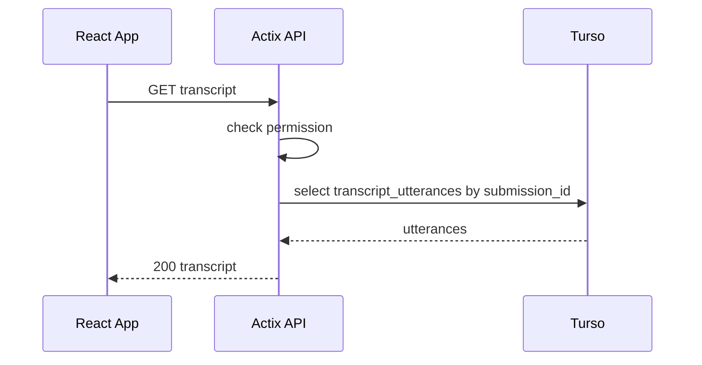

## 6. `GET /audio-submissions/:id/scorecard`

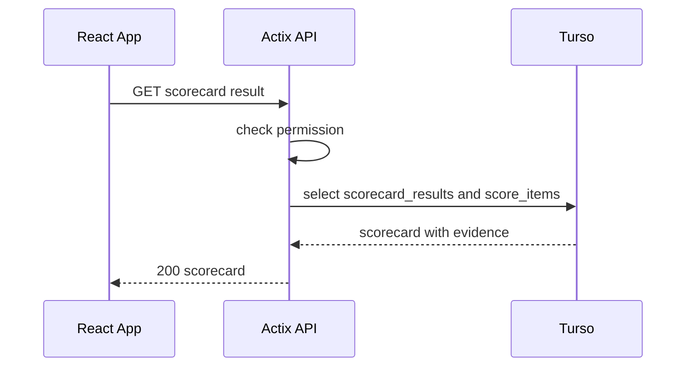

## 7. `PATCH /scorecard-results/:id/override`

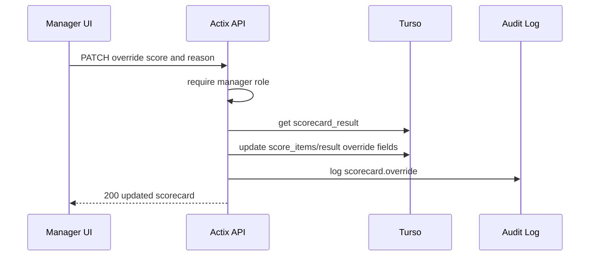

## 8. `GET /quality-scorecards/templates`

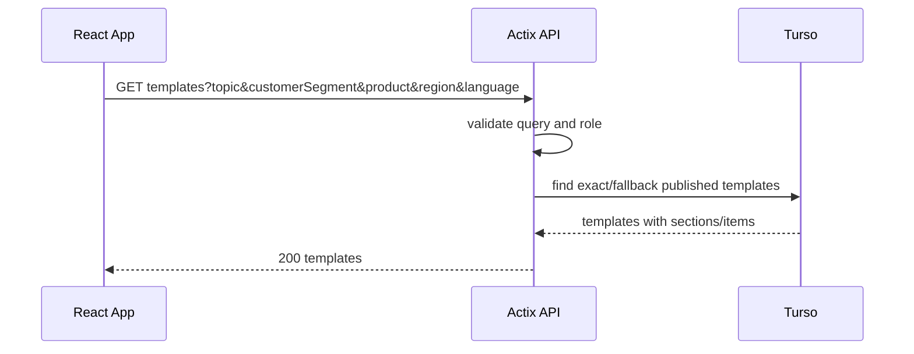

## 9. `POST /playbooks`

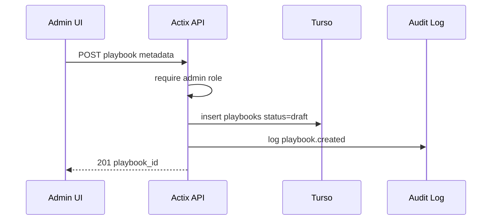

## 10. `POST /playbooks/:id/sections`

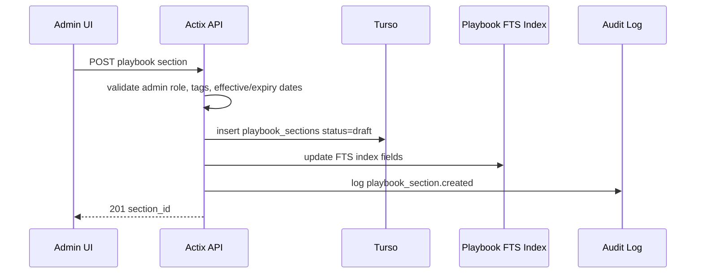

## 10.1 Knowledge Resource Import and Publish

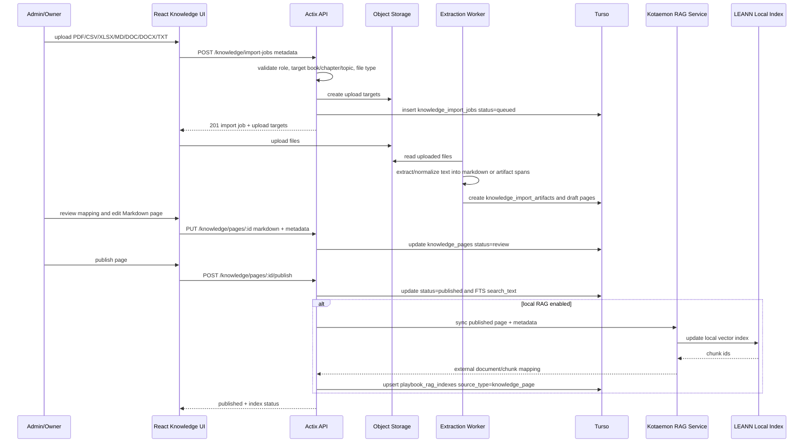

## 11. Ask Playbook Chat Session

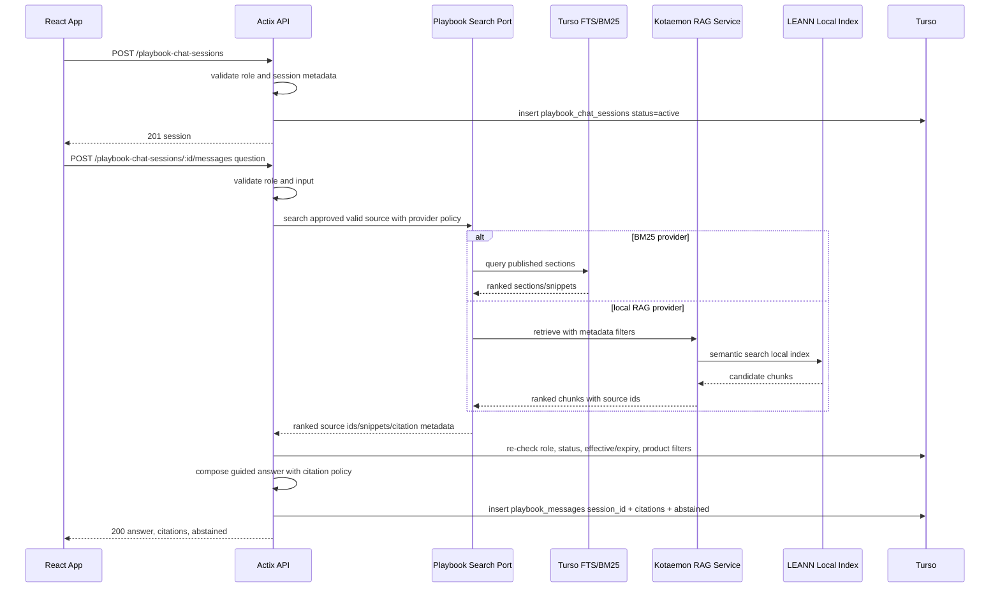

## 11.1 Playbook RAG Index Sync

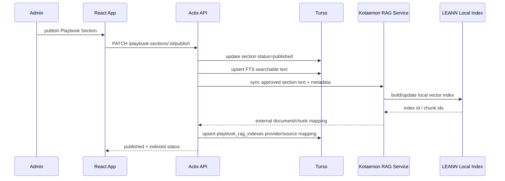

## 12. `GET /onboarding/tracks`

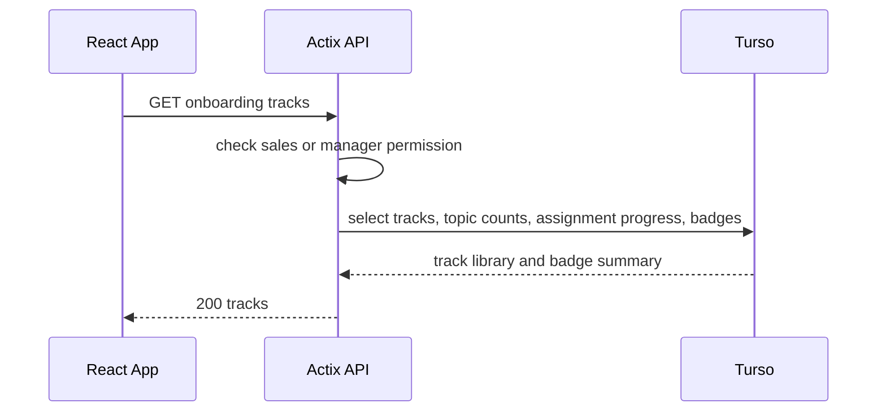

## 13. `GET /onboarding/tracks/:id`

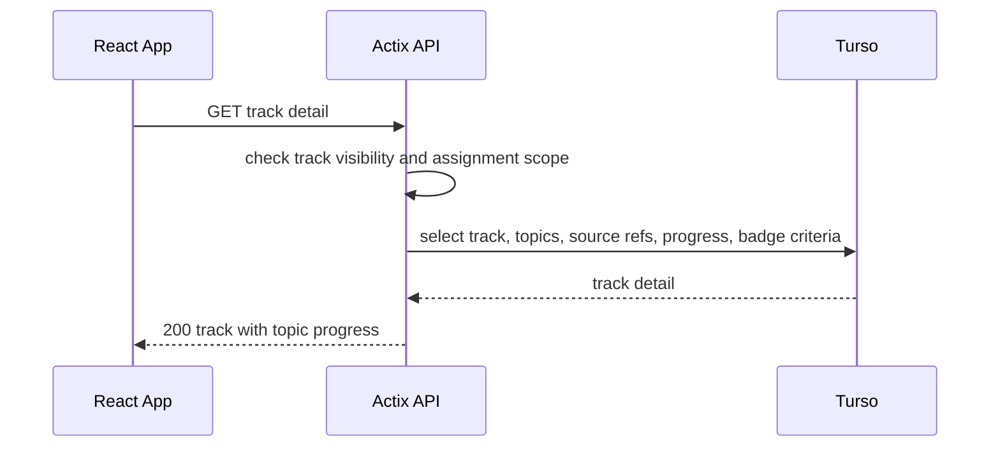

## 14. `POST /onboarding/senario-completions`

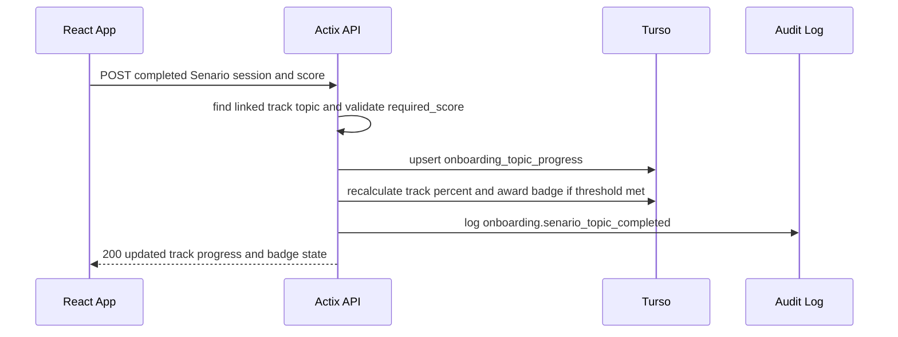

## 15. WSS `/ws/voice-sessions`

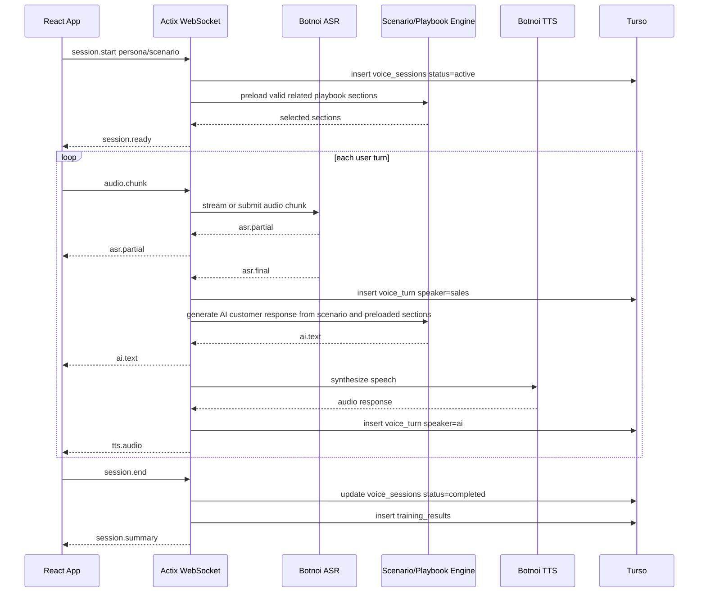
