# Data Model and ER Diagram

## 1. ER Diagram

```mermaid
erDiagram
    TEAMS ||--o{ USERS : has
    USERS ||--o| SALES_PROFILES : may_have
    USERS ||--o{ AUDIO_SUBMISSIONS : creates
    USERS ||--o{ QUALITY_REVIEW_BATCHES : creates
    USERS ||--o{ RECORDING_REVIEW_BATCHES : creates
    USERS ||--o{ PLAYBOOK_CHAT_SESSIONS : starts
    USERS ||--o{ KNOWLEDGE_IMPORT_JOBS : uploads
    USERS ||--o{ USER_KNOWLEDGE_BOOKMARKS : saves
    PLAYBOOK_CHAT_SESSIONS ||--o{ PLAYBOOK_MESSAGES : has
    USERS ||--o{ VOICE_SESSIONS : starts
    USERS ||--o{ TRAINING_RESULTS : receives
    USERS ||--o{ ONBOARDING_TRACK_ASSIGNMENTS : receives
    USERS ||--o{ USER_BADGES : earns
    USERS ||--o{ AUDIT_LOGS : acts

    QUALITY_REVIEW_BATCHES ||--o{ QUALITY_REVIEW_BATCH_ITEMS : contains
    QUALITY_REVIEW_BATCH_ITEMS ||--o{ AUDIO_SUBMISSIONS : may_create
    QUALITY_REVIEW_BATCH_ITEMS ||--o{ SCORECARD_RESULTS : evaluated_by
    RECORDING_REVIEW_BATCHES ||--o{ RECORDING_REVIEW_ATTEMPTS : contains
    RECORDING_REVIEW_BATCHES }o--|| SCORECARDS : uses_training_rubric
    RECORDING_REVIEW_ATTEMPTS }o--o| AUDIO_SUBMISSIONS : creates
    RECORDING_REVIEW_ATTEMPTS ||--o| SCORECARD_RESULTS : evaluated_by
    RECORDING_REVIEW_ATTEMPTS ||--o{ TRAINING_RESULTS : produces
    AUDIO_SUBMISSIONS ||--o{ TRANSCRIPT_UTTERANCES : has
    AUDIO_SUBMISSIONS ||--o{ SCORECARD_RESULTS : evaluated_by
    SCORECARDS ||--o{ SCORECARD_SECTIONS : contains
    SCORECARD_SECTIONS ||--o{ RULES : contains
    SCORECARDS ||--o{ SCORECARD_RESULTS : produces
    SCORECARD_RESULTS ||--o{ SCORE_ITEMS : has
    RULES ||--o{ SCORE_ITEMS : matched_by

    PLAYBOOKS ||--o{ PLAYBOOK_SECTIONS : contains
    KNOWLEDGE_BOOKS ||--o{ KNOWLEDGE_CHAPTERS : contains
    KNOWLEDGE_CHAPTERS ||--o{ KNOWLEDGE_TOPICS : contains
    KNOWLEDGE_TOPICS ||--o{ KNOWLEDGE_PAGES : contains
    KNOWLEDGE_PAGES ||--o{ KNOWLEDGE_IMPORT_ARTIFACTS : may_have
    KNOWLEDGE_IMPORT_JOBS ||--o{ KNOWLEDGE_IMPORT_ARTIFACTS : produces
    KNOWLEDGE_PAGES ||--o{ PLAYBOOK_RAG_INDEXES : indexed_as
    USER_KNOWLEDGE_BOOKMARKS }o--|| KNOWLEDGE_PAGES : bookmarks
    PLAYBOOK_SECTIONS ||--o{ PLAYBOOK_RAG_INDEXES : indexed_as
    PLAYBOOK_MESSAGES }o--o{ PLAYBOOK_SECTIONS : cites

    VOICE_SESSIONS ||--o{ VOICE_TURNS : has
    VOICE_SESSIONS ||--o{ VOICE_RESPONSE_LATENCY_EVENTS : tracks
    VOICE_TURNS ||--o{ VOICE_RESPONSE_LATENCY_EVENTS : prompts
    VOICE_SESSIONS ||--o{ TRAINING_RESULTS : summarizes
    AUDIO_SUBMISSIONS ||--o{ TRAINING_RESULTS : may_create

    ONBOARDING_TRACK_CATEGORIES ||--o{ ONBOARDING_TRACKS : categorizes
    SOLUTIONS ||--o{ ONBOARDING_TRACKS : scopes
    ONBOARDING_TRACKS ||--o{ ONBOARDING_TRACK_TOPICS : contains
    ONBOARDING_TRACKS ||--o{ ONBOARDING_TRACK_ASSIGNMENTS : assigned_as
    ONBOARDING_TRACKS ||--o{ ONBOARDING_BADGES : rewards
    ONBOARDING_TRACK_ASSIGNMENTS ||--o{ ONBOARDING_TOPIC_PROGRESS : tracks
    ONBOARDING_TRACK_TOPICS ||--o{ ONBOARDING_TOPIC_PROGRESS : completed_by
    ONBOARDING_BADGES ||--o{ USER_BADGES : awarded_as
    TRAINING_RESULTS }o--o{ ONBOARDING_TOPIC_PROGRESS : updates

    TEAMS {
        string id PK
        string name
        string manager_id FK
        string status
    }

    USERS {
        string id PK
        string team_id FK
        string name
        string email
        string role
        string status
        datetime created_at
    }

    SALES_PROFILES {
        string id PK
        string user_id FK
        string sales_code
        string product_line
        string region
        string language
        string readiness_status
        datetime onboarded_at
    }

    AUDIO_SUBMISSIONS {
        string id PK
        string user_id FK
        string type
        string product
        string scenario
        string customer_type
        string language
        string status
        string storage_uri
        int duration_sec
        datetime created_at
    }

    QUALITY_REVIEW_BATCHES {
        string id PK
        string user_id FK
        string created_by_user_id FK
        string scorecard_id FK
        string title
        string source_type
        string topic
        string customer_segment
        string product
        string region
        string language
        string status
        int total_items
        int completed_items
        int failed_items
        datetime created_at
        datetime started_at
        datetime completed_at
    }

    QUALITY_REVIEW_BATCH_ITEMS {
        string id PK
        string batch_id FK
        string audio_submission_id FK
        string recorded_by_user_id FK
        string source_type
        string file_name
        string mime_type
        int file_size_bytes
        string storage_uri
        string normalized_text_uri
        string status
        int sort_order
        float score
        string error_code
        datetime started_at
        datetime completed_at
    }

    RECORDING_REVIEW_BATCHES {
        string id PK
        string user_id FK
        string created_by_user_id FK
        string scorecard_id FK
        string title
        string input_mode
        string scenario
        string product
        string customer_segment
        string language
        string status
        int total_attempts
        int completed_attempts
        float latest_score
        datetime created_at
        datetime started_at
        datetime completed_at
    }

    RECORDING_REVIEW_ATTEMPTS {
        string id PK
        string batch_id FK
        string audio_submission_id FK
        string recorded_by_user_id FK
        string source_type
        string file_name
        string mime_type
        string storage_uri
        string status
        int sort_order
        float score
        string feedback_json
        string error_code
        datetime created_at
        datetime started_at
        datetime completed_at
    }

    TRANSCRIPT_UTTERANCES {
        string id PK
        string submission_id FK
        string speaker
        int start_ms
        int end_ms
        string text
        string edited_text
        string edited_by_user_id FK
        datetime edited_at
        float confidence
    }

    SCORECARDS {
        string id PK
        string name
        string type
        int version
        string status
    }

    SCORECARD_SECTIONS {
        string id PK
        string scorecard_id FK
        string label
        int sort_order
        int weight
        string status
    }

    RULES {
        string id PK
        string scorecard_id FK
        string section_id FK
        string label
        string type
        string severity
        int sort_order
        int weight
        string expected_evidence
        string example
        string config_json
        string status
    }

    SCORECARD_RESULTS {
        string id PK
        string batch_item_id FK
        string submission_id FK
        string scorecard_id FK
        float total_score
        string status
        string reviewed_by FK
        datetime created_at
    }

    SCORE_ITEMS {
        string id PK
        string result_id FK
        string rule_id FK
        float score
        string evidence_text
        int start_ms
        int end_ms
    }

    PLAYBOOKS {
        string id PK
        string owner_id FK
        string title
        string product
        string version
        string status
        date effective_date
        date expiry_date
    }

    PLAYBOOK_SECTIONS {
        string id PK
        string playbook_id FK
        string section_type
        string title
        string question
        string short_answer
        string detailed_answer
        string talk_track
        string do_say
        string dont_say
        string tags_json
        date effective_date
        date expiry_date
        string status
        string search_text
    }

    KNOWLEDGE_BOOKS {
        string id PK
        string owner_id FK
        string category
        string title
        string description
        string status
        int sort_order
        datetime created_at
        datetime updated_at
    }

    KNOWLEDGE_CHAPTERS {
        string id PK
        string book_id FK
        string title
        string description
        int sort_order
        string status
    }

    KNOWLEDGE_TOPICS {
        string id PK
        string chapter_id FK
        string title
        string description
        int sort_order
        string status
    }

    KNOWLEDGE_PAGES {
        string id PK
        string topic_id FK
        string owner_id FK
        string title
        string markdown_body
        string tags_json
        string source_type
        string status
        string version
        date effective_date
        date expiry_date
        string search_text
        datetime published_at
        datetime updated_at
    }

    KNOWLEDGE_IMPORT_JOBS {
        string id PK
        string user_id FK
        string target_book_id FK
        string target_chapter_id FK
        string target_topic_id FK
        string status
        int total_items
        int completed_items
        string error_code
        datetime created_at
        datetime completed_at
    }

    KNOWLEDGE_IMPORT_ARTIFACTS {
        string id PK
        string import_job_id FK
        string page_id FK
        string file_name
        string mime_type
        string storage_uri
        string normalized_text_uri
        string extraction_metadata_json
        string status
    }

    USER_KNOWLEDGE_BOOKMARKS {
        string id PK
        string user_id FK
        string page_id FK
        string source_context
        string source_session_id FK
        datetime created_at
    }

    PLAYBOOK_RAG_INDEXES {
        string id PK
        string provider
        string source_type
        string source_id FK
        string external_document_id
        string external_chunk_id
        string status
        datetime indexed_at
    }

    PLAYBOOK_CHAT_SESSIONS {
        string id PK
        string user_id FK
        string title
        string product
        string customer_segment
        string language
        string status
        datetime created_at
        datetime updated_at
    }

    PLAYBOOK_MESSAGES {
        string id PK
        string session_id FK
        string user_id FK
        string question
        string answer
        string citations_json
        boolean abstained
        string feedback
        datetime created_at
    }

    VOICE_SESSIONS {
        string id PK
        string user_id FK
        string persona
        string scenario
        string product
        string status
        datetime started_at
        datetime ended_at
    }

    VOICE_TURNS {
        string id PK
        string session_id FK
        string speaker
        string text
        string audio_uri
        datetime started_at
    }

    VOICE_RESPONSE_LATENCY_EVENTS {
        string id PK
        string session_id FK
        string ai_turn_id FK
        string user_id FK
        string action
        int latency_ms
        datetime captured_at
    }

    TRAINING_RESULTS {
        string id PK
        string user_id FK
        string session_id FK
        string submission_id FK
        string recording_review_batch_id FK
        string recording_review_attempt_id FK
        string type
        float score
        string summary_json
        datetime created_at
    }

    ONBOARDING_TRACKS {
        string id PK
        string title
        string solution
        string solution_id FK
        string category_id FK
        string level
        int version
        string status
        float badge_threshold_percent
        string owner_id FK
    }

    ONBOARDING_TRACK_CATEGORIES {
        string id PK
        string name
        string description
        string status
    }

    SOLUTIONS {
        string id PK
        string name
        string owner
        string status
    }

    ONBOARDING_TRACK_TOPICS {
        string id PK
        string track_id FK
        int sort_index
        string title
        string type
        string source_ref
        float required_score
        string required_senario_id FK
    }

    ONBOARDING_TRACK_ASSIGNMENTS {
        string id PK
        string track_id FK
        string sales_user_id FK
        string assigned_by FK
        string status
        datetime due_at
    }

    ONBOARDING_TOPIC_PROGRESS {
        string id PK
        string assignment_id FK
        string topic_id FK
        string status
        float score
        string completed_source_type
        string completed_source_id
        datetime completed_at
    }

    ONBOARDING_BADGES {
        string id PK
        string track_id FK
        string title
        float threshold_percent
        string icon_uri
        string status
    }

    USER_BADGES {
        string id PK
        string badge_id FK
        string user_id FK
        string awarded_from_assignment_id FK
        datetime awarded_at
    }

    AUDIT_LOGS {
        string id PK
        string actor_id FK
        string action
        string entity_type
        string entity_id
        string payload_json
        datetime created_at
    }
```

## 2. Modeling Notes

- `audio_submissions` เป็น abstraction หลักของ MVP แทน `calls` เพราะช่วงแรกยังไม่เชื่อม PBX/CTI
- `users.role` ใช้ role หลัก 3 แบบใน MVP คือ `sales`, `manager`, `admin`
- `sales_profiles` เก็บข้อมูลที่จำเป็นต่อ coaching/onboarding เท่านั้น ไม่ใช่ HRM profile
- `onboarding_tracks` คือ learning path หลักสำหรับ sales readiness โดยรวมหลาย topic เข้าเป็น track เดียว
- `onboarding_tracks.category_id`, `solution_id` และ `level` ใช้ทำ filter/reporting โดย `level` ต้องอยู่ใน `beginner`, `intermediate`, `advanced`
- `onboarding_track_categories` จัดกลุ่ม track เช่น Foundation, Solution Specialist, Enterprise และต้อง block delete ถ้ายังมี track ใช้งานอยู่
- `solutions` คือ catalog สำหรับ filter และ assign track โดย default MVP คือ Chatbot, Voicebot, Digital Human, CMS, DocSearch
- `onboarding_track_topics.type` รองรับ `knowledge`, `external_view`, `audio_response`, `recording_review`, และ `senario`
- `onboarding_track_topics.required_senario_id` ใช้ผูก topic กับ Senario หรือ Meeting Room; เมื่อ Senario complete และ score ผ่าน `required_score` จะอัปเดต `onboarding_topic_progress`
- `onboarding_badges.threshold_percent` ใช้ตัดสิน badge unlock จาก percent ของ topic ที่ complete ใน assignment นั้น
- `recording_review_batches` ใช้เก็บชุดการฝึก pitch/mock call เพื่อเปรียบเทียบ attempt หลายครั้ง เช่น attempt 1, 2, 3
- `recording_review_attempts.input_mode/source_type` รองรับ `browser_recording` และ `audio_upload`; ทุก attempt ที่เป็นเสียงควรมี `audio_submission_id` เพื่อ reuse storage/transcript pipeline
- `recording_review_attempts.status` ต้องรองรับ `draft` สำหรับ recording ที่กด stop แล้วแต่ยังไม่ส่งเข้า ASR queue, `queued`, `processing`, `scored`, `failed`
- `recording_review_batches.created_by_user_id` ใช้แสดงว่า batch ใครสร้าง ส่วน `recording_review_attempts.recorded_by_user_id` ใช้แสดงว่า recording/attempt ถูก record หรือ upload โดยใคร
- การ rename batch เป็น metadata update ของ `recording_review_batches.title` และไม่ควรแก้ไข attempt, transcript หรือ score result ย้อนหลัง
- attempt review modal ต้องอ่าน transcript ผ่าน `audio_submission_id` จาก `transcript_utterances` โดยเรียงตาม `start_ms` เพื่อ render แบบ SRT/timeline
- ถ้า ASR ถอดผิด ผู้ใช้แก้ utterance ได้โดยเก็บข้อความที่แก้ใน `transcript_utterances.edited_text` พร้อม `edited_by_user_id` และ `edited_at`; ห้ามทับ raw ASR `text`
- training rubric ใช้ `scorecards` เดิมโดยกำหนด `scorecards.type = training_rubric` เพื่อไม่แยก rubric engine ซ้ำจาก Quality Review
- `training_results` เชื่อมได้ทั้ง `voice_sessions`, `audio_submissions`, `recording_review_batches` และ `recording_review_attempts` เพราะ training มีทั้ง live voice Senario และ recording review
- `voice_response_latency_events` เก็บ hidden analytics ของ Senario โดยวัดจากจังหวะ AI/persona ตอบกลับจน user เริ่มพิมพ์, กด push-to-talk หรือส่งข้อความ; ไม่แสดงใน session UI แต่ใช้ aggregate เพื่อ coaching และ confidence analysis
- `playbooks` และ `playbook_sections` เป็น source หลักของ Playbook MVP แทน raw document/chunk dump
- `playbook_rag_indexes` เก็บ mapping ระหว่าง approved source ใน SaleSync กับ external/local RAG provider เช่น Kotaemon/LEANN เพื่อให้ citation ย้อนกลับมาที่ Playbook Section ได้
- `playbook_chat_sessions` เก็บ session ของหน้า Ask เพื่อให้ chat ต่อเนื่อง, list session และวัด unanswered/abstain rate ได้
- `playbook_sections.expiry_date` ใช้ป้องกันการตอบโปรโมชันหรือราคาเก่าที่หมดอายุ
- `playbook_messages.citations_json` ใช้ง่ายสำหรับ MVP แต่ถ้าต้อง query citation ลึกขึ้นให้แยกเป็นตาราง `playbook_message_citations`
- `score_items` ต้องเก็บ `start_ms` และ `end_ms` เพื่อย้อน evidence ไปยัง transcript/audio
- `audit_logs` ต้องเก็บทุก action สำคัญ เช่น override score, publish/expire playbook section, sign-off onboarding

## 3. Suggested Indexes

| Table | Index |
|---|---|
| `audio_submissions` | `(user_id, created_at)`, `(status, created_at)` |
| `recording_review_batches` | `(user_id, created_at)`, `(status, created_at)`, `(scorecard_id, created_at)` |
| `recording_review_attempts` | `(batch_id, sort_order)`, `(audio_submission_id)`, `(status, created_at)` |
| `sales_profiles` | `(user_id)`, `(sales_code)`, `(region, product_line)` |
| `transcript_utterances` | `(submission_id, start_ms)` |
| `scorecard_results` | `(submission_id)`, `(status, created_at)` |
| `playbook_sections` | `(playbook_id, section_type)`, `(status, effective_date, expiry_date)`, `(search_text)` |
| `playbook_rag_indexes` | `(provider, source_type, source_id)`, `(status, indexed_at)`, `(external_document_id)` |
| `voice_sessions` | `(user_id, started_at)` |
| `training_results` | `(user_id, created_at)`, `(recording_review_batch_id)`, `(recording_review_attempt_id)` |
| `onboarding_tracks` | `(status, version)`, `(owner_id, status)` |
| `onboarding_track_topics` | `(track_id, sort_index)`, `(type, required_senario_id)` |
| `onboarding_track_assignments` | `(sales_user_id, status)`, `(track_id, status)` |
| `onboarding_topic_progress` | `(assignment_id, topic_id)`, `(completed_source_type, completed_source_id)` |
| `user_badges` | `(user_id, awarded_at)`, `(badge_id, user_id)` |
| `audit_logs` | `(entity_type, entity_id)`, `(actor_id, created_at)` |
