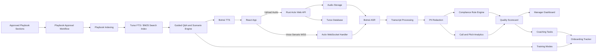

# แผนโครงการ SaleSync: Call Quality, AI Training และ Sales Onboarding

## 1. เป้าหมายโครงการ

สร้างระบบสำหรับยกระดับทีมขายให้มีมาตรฐานเดียวกัน ผ่าน 3 ความสามารถหลัก:

1. ตรวจสอบคุณภาพการโทรจากเสียงบันทึก ว่าพนักงานขายทำตามมาตรฐานองค์กรครบถ้วนหรือไม่
2. ฝึกอบรมและซักซ้อมกับ AI ที่ตอบจาก Playbook ขององค์กร
3. ติดตาม onboarding ของ sales ตั้งแต่ความรู้บริษัท ผลิตภัณฑ์ ไปจนถึงการรับมือกับลูกค้า

แนวทางเริ่มต้นของโปรเจกต์นี้คือ **ไม่เชื่อมต่อตู้โทรศัพท์หรือระบบ PBX/CCaaS ในช่วงแรก** แต่จะเริ่มจากการให้ผู้ใช้ upload ไฟล์เสียงการโทรหรือไฟล์เสียงที่อัดไว้ แล้วนำมาวิเคราะห์แบบ post-call ก่อน จากนั้นจึงต่อยอดเป็น training แบบโต้ตอบด้วยเสียงผ่าน Botnoi ASR/TTS และ WSS protocol

## 2. Problem Statement

ทีมขายมักเจอปัญหาหลักเหล่านี้:

- Onboarding ไม่สม่ำเสมอ พึ่งพาการ shadow หรือสอนจากหัวหน้าทีมมากเกินไป
- ความรู้กระจัดกระจายอยู่ในหลายแหล่ง เช่น PDF, script, FAQ, product sheet, battle card
- ตรวจคุณภาพการโทรได้เพียงบางส่วน เพราะ manager ฟังย้อนหลังได้ไม่ครบทุกสาย
- Feedback มาช้า ทำให้ sales ทำผิด pattern เดิมซ้ำ
- การพูดตามมาตรฐานองค์กรไม่ครบ เช่น ไม่แนะนำตัว ไม่ถามอาการแพ้ ไม่ซัก pain point หรือ pitch ไม่ครบ
- เสี่ยงด้าน compliance, PDPA, การพูดเกินจริง, การใช้คำไม่เหมาะสม หรือการเก็บข้อมูลอ่อนไหว

ดังนั้นระบบไม่ควรเป็นแค่ transcript หรือ chatbot แต่ควรเป็นวงจรปิดระหว่าง **call insight -> coaching -> playbook update -> onboarding -> sales readiness tracking**

ระบบนี้ **ไม่ใช่ HRM โดยตรง** แต่ต้องมี user และ sales profile สำหรับการใช้งานระบบ ได้แก่ sales สำหรับฝึกและดู feedback, manager สำหรับประเมิน/ติดตามทีม, และ admin สำหรับบริหารระบบ สิ่งที่ไม่อยู่ใน scope คือ payroll, leave, compensation, disciplinary record และ HR performance appraisal แบบทางการ

## 3. Scope ของระบบ

### In Scope

- Upload ไฟล์เสียงบันทึกการโทรหรือไฟล์เสียงฝึก pitch
- ถอดเสียงภาษาไทย/อังกฤษ และแยก speaker ระหว่าง sales กับลูกค้า
- ตรวจมาตรฐานการโทรด้วย rule engine และ AI scoring
- แสดง evidence ว่าคะแนนแต่ละข้ออ้างอิงจากช่วงใดของบทสนทนา
- สร้าง dashboard สำหรับ manager, admin และ sales
- เชื่อม Playbook จากเนื้อหาองค์กร เช่น Q&A, promotion, battle card, objection handling และ talk track
- Playbook Search และ Guided Q&A พร้อม citation จากเอกสารที่ได้รับอนุมัติ โดยเริ่มจาก source-first Playbook และรองรับ local RAG ด้วย LEANN + Kotaemon เมื่อพร้อม
- Training mode แบบ upload recording เพื่อประเมิน
- Training mode แบบ voice Senario ที่ sales คุยโต้ตอบกับ AI จริงผ่าน Botnoi ASR/TTS
- Sales onboarding tracker พร้อม progress, quiz, checklist และ coaching task

### Out of Scope สำหรับ MVP

- การเชื่อมต่อตู้โทรศัพท์, PBX, CTI หรือ CCaaS โดยตรง
- Full real-time agent assist ระหว่างโทรทุกสาย
- Auto action ไปยัง CRM โดยไม่ผ่าน human approval
- การตัดสิน performance รายบุคคลแบบอัตโนมัติโดยไม่มี reviewer
- ระบบ HRM เช่น payroll, leave, compensation หรือ HR appraisal
- การเชื่อม CRM/PBX อัตโนมัติตั้งแต่วันแรก
- การใช้ข้อมูลจาก open web เป็นแหล่งอ้างอิงหลักของ AI

## 4. Feature หลักที่ 1: Batch Quality Review และ Compliance Check

### 4.1 Use Case

ระบบรับ batch ของไฟล์เสียง เอกสาร บทความ sales script หรือคำตอบที่เตรียมไว้ แล้ววิเคราะห์ว่า content หรือ sales conversation ทำตามมาตรฐานองค์กรครบหรือไม่ เช่น:

- แนะนำตัวครบถ้วน
- แจ้งวัตถุประสงค์การโทร
- แจ้งสรรพคุณหรือ value proposition ถูกต้อง
- สอบถามอาการแพ้หรือข้อจำกัดที่เกี่ยวข้อง
- ซักถาม pain point
- เสนอ solution ในรูปแบบ pitching ที่เหมาะสม
- แนะนำเพิ่มเติมตาม playbook
- ไม่พูดคำหยาบหรือคำที่องค์กรห้ามใช้
- ไม่กล่าวอ้างเกินจริง
- แจ้งเงื่อนไข ราคา หรือ disclaimer ครบถ้วนเมื่อจำเป็น

### 4.2 Workflow

1. ผู้ใช้สร้าง review batch
2. เลือก source type เช่น audio, document หรือ article
3. เลือก guidance/scorecard template ตาม topic, product, segment, region และ language
4. เพิ่มหลายไฟล์หรือหลาย document เข้า batch
5. กด run batch เพื่อให้ backend process แบบ async เรียงทีละ item
6. ถ้าเป็นเสียง ระบบส่งเข้า Botnoi ASR หรือ ASR pipeline ที่เลือก
7. ถ้าเป็นเอกสาร/บทความ ระบบ extract/normalize text
8. ตรวจ PII และ mask ข้อมูลอ่อนไหว
9. วิเคราะห์ด้วย rule engine และ semantic scoring
10. สร้าง quality scorecard พร้อม evidence ราย item
11. ผู้ใช้ต้องกดเข้า batch detail เพื่อดู process/result ของแต่ละไฟล์
12. ส่งเคสที่เสี่ยงหรือคะแนนต่ำให้ manager review
13. สร้าง coaching recommendation ให้ sales

### 4.3 Scorecard ตัวอย่าง

| หมวด | เกณฑ์ตรวจ | ตัวอย่างคะแนน |
|---|---|---:|
| Opening | แนะนำตัวและบริษัทครบ | 10 |
| Discovery | ถาม pain point และบริบทลูกค้า | 20 |
| Product Playbook | อธิบายสรรพคุณ/ประโยชน์ถูกต้อง | 20 |
| Compliance | แจ้งข้อควรระวัง เงื่อนไข หรือ disclaimer | 20 |
| Pitch Quality | นำเสนอเป็นเหตุผล มี structure และเหมาะกับลูกค้า | 15 |
| Professionalism | ไม่ใช้คำหยาบ ไม่กดดัน ไม่พูดเกินจริง | 15 |

### 4.4 Rule Engine ที่ควรมี

- Required phrase rule: ต้องพูดข้อความหรือความหมายที่จำเป็น
- Negative phrase rule: ห้ามพูดคำหรือ claim บางประเภท
- Semantic rule: ตรวจความหมาย ไม่ยึด keyword อย่างเดียว
- Sequence rule: ตรวจว่าขั้นตอนสำคัญเกิดในลำดับที่เหมาะสม
- Conditional rule: ถ้ามีการพูดเรื่องราคา ต้องพูดเงื่อนไขประกอบ
- Evidence rule: ทุก flag ต้องย้อนกลับไปยัง transcript ช่วงที่เกี่ยวข้องได้

### 4.5 MVP Acceptance Criteria

- สร้าง batch และเพิ่ม item หลายรายการได้
- run batch แล้ว process แบบ async sequential ทีละ item
- batch list แสดง summary เท่านั้น และ batch detail แสดง progress/result ราย item
- audio item มี transcript พร้อม speaker label และ timestamp
- document/article item มี evidence span จาก paragraph, heading หรือ sentence
- มี scorecard พร้อม evidence ราย item
- Manager สามารถ override คะแนนได้
- ระบบแยก critical issue ได้ เช่น ไม่แจ้ง disclaimer, พูดคำต้องห้าม, กล่าวอ้างเกินจริง
- ยังไม่ต้องเชื่อม PBX/CTI/CCaaS ใน MVP

## 5. Feature หลักที่ 2: AI Training และ Playbook Search

### 5.1 Use Case

สร้าง Playbook สำหรับฝึก sales ในรูปแบบคล้าย blog/FAQ/playbook โดยเขียนคำถาม คำตอบ รายละเอียด ตัวอย่าง talk track และ tag ไว้ล่วงหน้า จากนั้นใช้ full-text search และ guided answer จากเนื้อหาที่อนุมัติแล้ว เช่น:

- ข้อมูลบริษัท
- ข้อมูลผลิตภัณฑ์
- pricing และ promotion
- FAQ
- competitor battle card
- objection handling
- use case ของลูกค้าแต่ละ segment
- sales script
- policy และ compliance guide

MVP เริ่มจาก source-first retrieval บน approved Playbook Sections เพื่อคุม latency, citation และ governance ให้แน่นก่อน จากนั้นสามารถเพิ่ม local RAG ได้โดยใช้ **LEANN** เป็น local/private vector index และ **Kotaemon** เป็น RAG management/pipeline service สำหรับจัดการ document ingestion, retrieval pipeline และ chat-with-docs workflow

แนวทางนี้เป็นไปได้ แต่ควรแยก boundary ชัดเจน:

- SaleSync ยังเป็น product UI, auth, role, Playbook governance, audit และ API หลัก
- Turso ยังเก็บ metadata, playbook sections, status, tags, effective/expiry date, chat session และ citations
- LEANN ใช้เป็น local vector/index backend สำหรับ semantic retrieval จาก approved content หรือเอกสารที่ sync แล้ว
- Kotaemon ใช้เป็น RAG service/admin layer หรือ internal tool สำหรับจัดการ ingestion, retrieval pipeline และทดลอง prompt/RAG flow
- Ask และ Voice Senario ต้องเรียกผ่าน SaleSync backend เท่านั้น ไม่ให้ frontend เรียก Kotaemon/LEANN โดยตรง
- Voice Senario ควร preload top-k context ก่อนเริ่ม turn หรือ session เพื่อลด latency ไม่ควรค้น RAG หนักทุก audio turn

### 5.2 Training Modes

| Mode | รายละเอียด |
|---|---|
| Ask | ค้นและตอบแบบ source-first จาก Playbook พร้อม citation |
| Compare | เปรียบเทียบผลิตภัณฑ์กับคู่แข่งตาม battle card |
| Use Case Drill | ถามสถานการณ์ลูกค้า แล้วให้ sales เลือกวิธีตอบ |
| Recording Review | sales กดอัดเสียงใน browser หรือ upload ไฟล์เสียง pitch/mock call เข้า batch แล้วระบบถอดเสียง ประเมินด้วย training rubric และให้ feedback เทียบแต่ละ attempt |
| Voice Senario | sales คุยกับ AI แบบเสียงจริง โดยใช้ Botnoi ASR แปลงเสียง sales เป็นข้อความ และ Botnoi TTS ให้ AI พูดตอบ |
| Text Senario | AI จำลองลูกค้าตาม persona ผ่าน text chat เช่น สนใจราคา กังวลความปลอดภัย หรือเทียบคู่แข่ง |
| Pitch Coach | sales พิมพ์ อัดเสียง หรือคุยสดกับ AI แล้วระบบให้ feedback |
| Objection Handling | ฝึกตอบข้อโต้แย้ง เช่น แพงไป ยังไม่พร้อม ใช้คู่แข่งอยู่ |
| Product Quiz | ทดสอบความเข้าใจ feature, benefit, limitation และ compliance |

### 5.3 Playbook Structure

Playbook ควรเป็น library ที่มี sections และ tags ไม่ใช่ raw document dump

| Field | รายละเอียด |
|---|---|
| playbook_title | ชื่อ playbook เช่น Product A Sales Playbook, Q2 Promotion Playbook |
| section_type | FAQ, Product, Pricing, Promotion, Competitor, Objection, Compliance, Talk Track |
| title | หัวข้อ section |
| question | คำถามหลัก เช่น "ต่างจากคู่แข่ง X อย่างไร" |
| short_answer | คำตอบสั้นสำหรับ sales ใช้ตอบเร็ว |
| detailed_answer | รายละเอียดเพิ่มเติม |
| talk_track | ประโยคแนะนำสำหรับพูดกับลูกค้า |
| do_say | สิ่งที่ควรพูด |
| dont_say | สิ่งที่ห้ามพูดหรือควรหลีกเลี่ยง |
| examples | ตัวอย่าง use case หรือคำตอบ |
| tags | product, promotion, competitor, pricing, compliance, objection, persona |
| related_personas | persona ที่เกี่ยวข้อง |
| effective_date | วันที่เริ่มใช้ |
| expiry_date | วันที่หมดอายุ ใช้กับ promotion/pricing/campaign |
| status/version/owner | governance ของ playbook section |

### 5.4 Playbook Tags และ Section Types

ระบบควรมี tags เพราะ promotion และข้อมูลเชิงการขายเปลี่ยนบ่อย การค้นและการตอบต้อง filter ตามช่วงเวลา product region และ persona ได้

| Tag Group | Examples |
|---|---|
| product | product-a, product-b, add-on |
| section_type | faq, promotion, competitor, objection, compliance, talk-track |
| persona | non-tech, distracted, fake-budget, price-sensitive, competitor-user |
| segment | sme, enterprise, retail, healthcare |
| region | th, sg, global |
| lifecycle | draft, review, published, expired, archived |
| validity | always-on, campaign-only, seasonal |
| risk | normal, price-sensitive, compliance-sensitive |

promotion section ต้องมีอย่างน้อย:

- promotion_name
- campaign_code ถ้ามี
- effective_date
- expiry_date
- eligibility
- terms_and_conditions
- do_say
- dont_say
- fallback_answer เมื่อ promotion หมดอายุ

### 5.5 AI Customer Persona Structure

persona สำหรับ voice Senario ต้องกำหนดลักษณะลูกค้าจำลองไว้ล่วงหน้า เพื่อลด latency และทำให้การฝึกมีเป้าหมายชัดเจน

| Field | ตัวอย่าง |
|---|---|
| name | CFO งบน้อย, Founder สาย non-tech, User ที่ใช้คู่แข่งอยู่ |
| tech_literacy | low, medium, high |
| budget_claim | บอกว่างบเยอะ |
| budget_truth | จริง ๆ งบจำกัดและต้องขออนุมัติ |
| behavior_rules | ชอบพูดนอกเรื่อง, ถามซ้ำ, ไม่เข้าใจศัพท์เทคนิค |
| objections | แพงไป, ใช้คู่แข่งอยู่, กลัว implementation ยาก |
| patience_level | low/medium/high |
| decision_style | emotional, analytical, committee-based |
| success_condition | sales ต้องถาม budget จริง, pain point, decision process |

persona MVP ที่ควรมี:

- ไม่เข้าใจเทคโนโลยี: ต้องการคำอธิบายง่าย ห้ามใช้ศัพท์เทคนิคเยอะ
- ชอบพูดนอกเรื่อง: ทดสอบความสามารถในการดึงบทสนทนากลับมา
- บอกว่างบเยอะแต่จริง ๆ ไม่มีเงิน: ทดสอบ budget qualification
- ใช้คู่แข่งอยู่: ทดสอบ competitor handling
- สนใจแต่ราคา: ทดสอบ value selling

### 5.6 Voice Senario Workflow

1. Sales เลือก persona, product, scenario และระดับความยาก
2. Backend preload persona, scenario และ related playbook sections ก่อนเริ่ม session
3. Frontend เปิด session ผ่าน WSS ไปยัง Rust/Actix Web backend
4. Browser ส่ง audio chunk ของ sales ไปยัง backend
5. Backend ส่งเสียงเข้า Botnoi ASR เพื่อถอดคำพูด
6. Scenario engine ใช้ persona rules + conversation state + preloaded articles เพื่อสร้างคำตอบ
7. Backend ส่งข้อความเข้า Botnoi TTS
8. Frontend เล่นเสียงตอบกลับ และแสดง transcript แบบ real-time หรือ near real-time
9. Frontend บันทึก hidden response latency event หลัง AI ตอบกลับ โดยวัดถึงจังหวะที่ sales เริ่มพิมพ์, กด push-to-talk หรือส่งข้อความ เพื่อใช้วิเคราะห์ hesitation/confidence โดยไม่แสดงใน UI
10. เมื่อจบ session ระบบสรุปคะแนน เช่น discovery, objection handling, product accuracy, compliance และ confidence

### 5.7 Recording Review Workflow

1. Sales สร้าง Recording Review Batch และเลือก training rubric
2. Sales เลือก input mode ระหว่าง `browser_recording` หรือ `audio_upload`
3. Sales เพิ่ม attempt เข้า batch โดยกดอัดเสียงใน browser หรือ upload ไฟล์เสียง
4. Sales หรือ manager สามารถ rename batch เพื่อจัดการรอบฝึกหรือ scenario ได้ชัดเจนขึ้น
5. ระบบถอดเสียงด้วย Botnoi ASR
6. วิเคราะห์ด้วย training rubric ที่ใช้โครงสร้างเดียวกับ scorecard/template management
7. แสดง transcript, score, evidence และคำแนะนำเพื่อปรับ pitch
8. Sales เปิด attempt review modal เพื่อดู audio playback, ASR transcript, speaker label และ timestamp แบบ SRT/timeline
9. Sales ทำ attempt เพิ่ม เช่น ครั้งที่ 1, 2, 3 เพื่อดู score trend และ coaching focus ที่ดีขึ้น
10. บันทึกผลเข้า onboarding progress และ coaching history

### 5.8 Playbook Workflow

1. Owner สร้างหรืออัปเดต playbook section
2. Product, training หรือ legal review
3. Approve section
4. สร้าง/อัปเดต full-text index จาก title, question, answer, details และ tags
5. ถ้าเปิด local RAG ให้ sync approved section ไปยัง Kotaemon/LEANN index โดยเก็บ mapping กลับมาที่ `playbook_section_id`
6. ตรวจ effective_date/expiry_date โดยเฉพาะ promotion และ pricing
7. Publish ไปยัง production
8. Run evaluation ด้วยชุดคำถาม gold set
9. เก็บ feedback จากคำถามที่ตอบไม่ได้หรือ citation ไม่ดี
10. Auto-hide หรือ mark expired เมื่อพ้น expiry_date

### 5.9 Local RAG Architecture: LEANN + Kotaemon

ใช้เมื่อ Playbook มีเนื้อหาเยอะขึ้น, ต้องการ semantic search มากกว่า BM25 หรือมีไฟล์เอกสารภายในที่อยากถามตอบแบบ local/private

| Component | บทบาทใน SaleSync |
|---|---|
| SaleSync Backend | Auth, role guard, Playbook approval, effective/expiry filtering, audit, answer policy, citation contract |
| Turso | Source of truth สำหรับ metadata, Playbook Section, session, message, citation และ feedback |
| Kotaemon | RAG management service สำหรับ document ingestion, pipeline config, retriever/reranker/prompt ทดลอง และ internal RAG UI |
| LEANN | Local/private vector index สำหรับ semantic retrieval โดยลด storage footprint และไม่ต้องส่งเอกสารไป vector DB cloud |
| Object Storage/Local Files | เก็บไฟล์ต้นฉบับและ normalized text artifact |

Recommended flow:

1. Admin publish Playbook Section ใน SaleSync
2. Backend สร้าง normalized text artifact และ metadata เช่น `playbook_section_id`, product, tags, effective/expiry, status
3. Index worker sync เฉพาะ approved/valid source เข้า Kotaemon ingestion pipeline
4. Kotaemon ใช้ LEANN เป็น vector/index backend หรือ retriever adapter สำหรับ local semantic search
5. Ask API เรียก `PlaybookSearchPort` ซึ่งเลือกได้ระหว่าง BM25, Kotaemon/LEANN หรือ hybrid
6. Backend filter source อีกครั้งตาม role, effective/expiry, product และ compliance policy
7. Backend compose answer พร้อม citation ที่ map กลับมาที่ Playbook Section ไม่ใช่ raw chunk ลอย ๆ
8. ถ้า source ไม่พอ ให้ abstain แทนการเดา

MVP recommendation:

- Phase แรกใช้ Turso FTS/BM25 + answer template ต่อไปเพื่อให้ UI/API เสถียร
- เพิ่ม Kotaemon/LEANN เป็น optional local RAG provider หลัง contract ของ Ask stable แล้ว
- เริ่มจาก admin/internal mode ก่อน production voice Senario
- ทำ evaluation set เทียบ BM25 vs LEANN semantic retrieval ก่อนเปิดใช้งานจริง
- ห้ามให้ Kotaemon เป็น source of truth ของ promotion/pricing; source of truth ต้องเป็น SaleSync Playbook/Turso

### 5.10 Guardrails

- ใช้เฉพาะ approved source
- บังคับ citation ทุกคำตอบที่เป็น factual answer
- ห้าม generate คำตอบเกิน source โดยเฉพาะราคา policy และ compliance
- ห้ามใช้ promotion/pricing section ที่หมดอายุแล้วในการตอบ production
- จำกัดสิทธิ์เข้าถึงตาม role และ team
- ไม่เดาเรื่องราคา กฎหมาย policy หรือ claim สำคัญ
- ป้องกัน prompt injection จากเอกสารหรือข้อความที่ user paste เข้ามา
- เก็บ audit log ของคำถาม คำตอบ source และ model version

### 5.11 MVP Acceptance Criteria

- สร้าง playbook และ playbook section ได้
- section รองรับ tags, section_type, effective_date และ expiry_date
- ถามตอบจากเอกสารพร้อม citation ได้
- ใช้ full-text search/BM25 เป็น retrieval หลักใน phase แรก และรองรับ optional local RAG provider ด้วย Kotaemon/LEANN เมื่อผ่าน evaluation
- มี Senario อย่างน้อย 3 persona
- persona รองรับ behavior เช่น ไม่เข้าใจเทคโนโลยี, ชอบพูดนอกเรื่อง, งบจริงไม่ตรงกับที่พูด
- มี recording review จากไฟล์เสียงที่ sales upload
- มี voice Senario ผ่าน Botnoi ASR/TTS อย่างน้อย 1 scenario
- มี evaluation set อย่างน้อย 100-200 คำถามในช่วง MVP
- promotion ที่หมดอายุต้องไม่ถูกนำมาตอบใน Guided Q&A หรือ voice Senario
- AI abstain ได้เมื่อไม่มีข้อมูลใน source

## 6. Feature หลักที่ 3: Sales Onboarding Tracking

### 6.1 Use Case

ติดตาม progress ของ sales ใหม่หรือ sales ที่ต้อง re-train ให้ผ่าน competency ที่องค์กรกำหนด เช่น:

- เข้าใจข้อมูลบริษัท
- เข้าใจผลิตภัณฑ์
- เข้าใจกลุ่มลูกค้าเป้าหมาย
- รู้ pain point และ use case สำคัญ
- รู้วิธีเทียบกับคู่แข่ง
- รับมือ objection ได้
- พูด pitch ได้ครบตามมาตรฐาน
- ผ่าน call quality threshold

### 6.2 Onboarding Structure

| Module | ตัวอย่างเนื้อหา | วิธีวัดผล |
|---|---|---|
| Company | positioning, target market, brand promise | quiz |
| Product | feature, benefit, limitation, use case | quiz + Q&A drill |
| Customer | persona, pain point, buying trigger | scenario drill |
| Pitching | opening, discovery, value proposition, closing | pitch coach |
| Compliance | disclosure, prohibited claim, data handling | quiz + call quality |
| Competitor | comparison, differentiation, objection | Senario |
| Live Call Readiness | call simulation และ reviewed call | manager sign-off |

### 6.3 Progress Tracking

ควรมีสถานะอย่างน้อย:

- Not started
- In progress
- Needs review
- Passed
- Needs retraining

### 6.4 Dashboard สำหรับ Manager

- รายชื่อ sales และ onboarding progress
- module ที่ผ่าน/ไม่ผ่าน
- quiz score
- pitch score
- call quality score เฉลี่ย
- common weakness ของแต่ละคน
- coaching task ที่ยังไม่เสร็จ
- readiness status ก่อนให้รับ lead จริง

### 6.5 MVP Acceptance Criteria

- สร้าง onboarding path ได้
- assign path ให้ sales ได้
- sales ทำ quiz, Senario และ pitch practice ได้
- manager เห็น progress และให้ sign-off ได้
- ดึง signal จาก call quality มาเป็น coaching task ได้

## 7. Architecture แนะนำ

### Technology Stack

| Layer | Technology | หน้าที่ |
|---|---|---|
| Frontend | React | สร้าง web application สำหรับ sales, manager และ admin |
| UI | Tailwind CSS + shadcn/ui | ทำ dashboard, form, table, audio player, scorecard และ training UI |
| Client State | Zustand | จัดการ state ของ upload flow, voice session, filters และ onboarding progress |
| Backend | Rust + Actix Web, DDD + Clean Architecture | REST API, business logic, authentication, file metadata, scoring orchestration โดยใช้ structure ตาม [backend-architecture-standard.md](./backend-architecture-standard.md) |
| Realtime | WSS protocol ผ่าน Actix WebSocket handler | ใช้สำหรับ voice Senario session, audio chunk streaming, transcript event และ TTS playback event |
| Database | Turso Database | เก็บ users, metadata, scorecards, rules, playbook sections, training sessions และ progress |
| ASR | Botnoi ASR | ถอดเสียงจากไฟล์ upload และเสียงสดระหว่าง Senario |
| TTS | Botnoi TTS | สร้างเสียงตอบกลับของ AI ใน voice Senario |
| Storage | Object storage หรือ local-compatible storage ในช่วง dev | เก็บไฟล์เสียงต้นฉบับและ processed artifacts |
| Playbook Search | Turso FTS/BM25 + optional Kotaemon/LEANN local RAG | ค้น approved Playbook, semantic retrieval แบบ local/private, แสดง snippet/citation และยังคุม source governance ใน SaleSync |

### MVP Architecture Decision

- ช่วงแรกใช้ **manual batch upload** เป็น input หลักของ Quality Review โดยรองรับ audio/document/article
- document/article batch ใน MVP รองรับ `.md`, `.txt`, `.doc`, `.docx` และใช้ queue/result flow เดียวกับ audio batch
- WSS ใช้สำหรับ **training voice Senario** เท่านั้น ไม่ใช่การรับสายจากตู้โทรศัพท์
- PBX/CTI/CCaaS integration ถูกเลื่อนไปเป็น phase หลังจาก MVP และ pilot
- Turso เป็น database หลักสำหรับ metadata และ workflow state ส่วนไฟล์เสียงควรเก็บใน object storage แล้วอ้างอิง URI ใน Turso
- Botnoi ASR/TTS เป็น provider หลักของ voice capability ใน MVP เพื่อลด scope การเชื่อมหลาย provider

## 8. Data Model เบื้องต้น

### Core Entities

| Entity | รายละเอียด |
|---|---|
| User | account สำหรับ sales, manager, admin พร้อม role และสถานะ |
| Team | ทีมขายหรือ business unit |
| SalesProfile | ข้อมูล sales เพื่อ coaching/onboarding เช่น team, manager, product line, region, language, readiness status |
| QualityReviewBatch | parent work unit สำหรับกลุ่มไฟล์หรือ document ที่ใช้ guidance เดียวกัน |
| QualityReviewBatchItem | item รายไฟล์/ราย document ใน batch พร้อม status และ result |
| RecordingReviewBatch | parent training unit สำหรับ pitch/mock call attempts ที่ใช้ training rubric เดียวกัน |
| RecordingReviewAttempt | attempt รายครั้งใน batch รองรับ browser recording และ audio upload พร้อม sort order, score และ feedback |
| AudioSubmission | metadata ของไฟล์เสียง เช่น type, scenario, product, customer type, timestamp |
| Recording | audio file, storage URI, duration, format, retention status |
| Transcript | utterance, speaker, timestamp, confidence |
| Scorecard | rubric, score, evidence, reviewer override |
| Rule | compliance rule, severity, condition |
| CoachingTask | task ที่เกิดจาก call quality หรือ manager assign |
| Playbook | ชุดเนื้อหาสำหรับ product, promotion, competitor หรือ sales motion |
| PlaybookSection | section ภายใน playbook พร้อม type, tags, owner, version, status, effective/expiry date |
| Citation | mapping ระหว่างคำตอบ AI กับ playbook section |
| TrainingSession | recording review, voice Senario, text Senario, quiz, pitch practice |
| VoiceSession | WSS session, persona, scenario state, ASR/TTS events, transcript |
| OnboardingPath | module และ requirement ที่ sales ต้องผ่าน |
| Progress | สถานะของ sales ต่อแต่ละ module |

## 9. Roadmap

### Phase 0: Discovery และ Design (1-2 สัปดาห์)

- กำหนดรูปแบบไฟล์เสียงที่รองรับ เช่น mp3, wav, m4a, webm
- กำหนด upload limit, retention, storage path และ metadata ที่ต้องกรอก
- นิยาม scorecard มาตรฐานองค์กร
- รวบรวม playbook sections ชุดแรก
- ออกแบบ voice Senario flow ผ่าน Botnoi ASR/TTS และ WSS
- กำหนด policy ด้าน consent, retention, access control และ PII
- กำหนด MVP scope และ success metrics

### Phase 1: MVP Post-Call Quality (3-4 สัปดาห์)

- Audio upload flow
- Botnoi ASR สำหรับไฟล์เสียง
- Speaker diarization
- Transcript viewer
- Rule engine ชุดแรก
- quality scorecard พร้อม evidence
- Manager review และ override

### Phase 2: Playbook Search และ Training MVP (3-4 สัปดาห์)

- Playbook indexing จาก approved sections
- Turso FTS/BM25 search พร้อม citation
- Guided Q&A แบบ source-first
- Ask mode
- Recording review mode แบบ batch + attempts + training rubric
- Voice Senario ผ่าน WSS + Botnoi ASR/TTS
- Pitch coach เบื้องต้นจากไฟล์เสียงและ transcript
- Evaluation set สำหรับ Q&A

### Phase 3: Onboarding Tracker (2-3 สัปดาห์)

- Onboarding path
- Module progress
- Quiz และ training task
- Manager sign-off
- Dashboard รวม progress, quiz score, pitch score และ call quality signal

### Phase 4: Pilot และ Calibration (2-3 สัปดาห์)

- Pilot กับ 1-2 sales teams
- เก็บ human label สำหรับ call quality
- ปรับ rule, prompt, rubric และ playbook source
- วัด KPI เทียบ baseline
- สรุป go/no-go สำหรับ rollout

### Phase 5: Scale และ Advanced Features

- PBX/CTI/CCaaS integration
- CRM integration
- LMS integration
- Selective real-time alert
- Advanced analytics เช่น trend, topic, objection pattern
- Multi-model fallback สำหรับภาษาไทย/อังกฤษปนกัน
- Automated playbook gap detection

## 10. POC Plan

ระยะเวลาแนะนำ: **6-8 สัปดาห์**

### Scope ของ POC

- 20-40 sales reps
- 300-800 uploaded audio files หรือ 50-120 ชั่วโมงเสียงสำหรับ MVP pilot
- 100-200 audio submissions ที่มี human label สำหรับ calibration
- 50-100 voice Senario sessions สำหรับประเมิน latency, UX และ conversation quality
- 100-300 playbook search/guided Q&A gold questions สำหรับประเมิน source matching และ abstention

### POC Exit Criteria

- Transcript คุณภาพพอให้ scoring ใช้งานได้
- Compliance rule มี precision/recall อยู่ในระดับที่ manager เชื่อถือ
- Feedback หลังสายเร็วพอใช้ coaching จริง
- Voice Senario คุยโต้ตอบได้ต่อเนื่องโดย latency ไม่ทำให้ผู้ใช้เสีย flow
- Guided Q&A ตอบพร้อม citation และไม่ generate เกิน source เรื่องสำคัญ
- Manager ใช้ dashboard จริง
- Sales ใช้ training mode ซ้ำ ไม่ใช่ทดลองครั้งเดียวแล้วหยุด

## 11. KPI

| กลุ่ม | KPI |
|---|---|
| Transcript | WER ภาษาไทย, WER ภาษาอังกฤษ, speaker diarization error |
| Coverage | % ไฟล์เสียงที่ upload, ถอดเสียง และวิเคราะห์สำเร็จ |
| Compliance | precision/recall ของ rule hit, false positive ต่อ 100 calls |
| Quality Ops | time from call end to score, override rate |
| Coaching | improvement ของ score หลัง coaching |
| Q&A | source match quality, citation correctness, abstention quality |
| Voice Senario | ASR latency, TTS latency, user response latency, turn completion rate, session drop rate |
| Onboarding | time to readiness, module completion rate, quiz pass rate |
| Adoption | weekly active sales, manager dashboard usage |

## 12. Security, Privacy และ Governance

ข้อกำหนดที่ควรมีตั้งแต่ต้น:

- Consent หรือ notice สำหรับการบันทึกและวิเคราะห์สาย
- Encryption at rest และ in transit
- Role-based access control
- Audit log
- Retention policy แยก audio, transcript, summary, score และ playbook search index
- PII redaction
- Human review สำหรับเคสสำคัญ
- Source approval workflow สำหรับ Playbook
- Data deletion และ export process
- Data residency และ subprocessor review หากใช้ vendor ภายนอก

## 13. ความเสี่ยงและแนวทางลดความเสี่ยง

| ความเสี่ยง | ผลกระทบ | แนวทางลดความเสี่ยง |
|---|---|---|
| STT ภาษาไทยไม่แม่น | scoring ผิด | ใช้ custom vocabulary, human label, model comparison |
| Rule false positive สูง | sales ไม่เชื่อระบบ | เริ่มจาก post-call, ให้ manager override, calibrate ต่อเนื่อง |
| Playbook ไม่พร้อม | AI ตอบไม่ได้หรือตอบผิด | ทำ approval workflow และ owner ชัดเจน |
| ไม่มี citation | ใช้คำตอบตรวจสอบไม่ได้ | บังคับ source citation ทุก factual answer |
| ข้อมูลอ่อนไหวรั่ว | เสี่ยง PDPA และ reputational risk | PII redaction, RBAC, retention, audit |
| Manager ไม่ใช้ dashboard | coaching loop ไม่เกิด | ออกแบบ workflow ให้ลดงาน ไม่เพิ่มงาน |
| Sales มองว่าเป็นระบบจับผิด | adoption ต่ำ | Position เป็น coaching และ enablement tool พร้อม transparency |

## 14. Backlog ระดับ Epic

### Epic 1: Call Ingestion

- Upload recording
- Audio file validation
- Audio metadata form
- Submission status tracking
- Storage และ retention status

### Epic 2: Speech Processing

- Botnoi ASR integration
- Speaker diarization
- Language detection
- Custom vocabulary
- PII redaction

### Epic 3: Quality Scorecard

- Rubric builder
- Rule builder
- Evidence mapping
- Score calculation
- Reviewer override

### Epic 4: Manager Dashboard

- Call list
- Risk filter
- Score trend
- Team comparison
- Coaching task assignment

### Epic 5: Playbook

- Playbook builder
- Playbook section editor
- Approval workflow
- Tags, effective date และ expiry date
- Search index
- Citation service

### Epic 6: AI Training

- Ask mode
- Recording review mode
- Voice Senario mode
- WSS session service
- Botnoi TTS integration
- Pitch coach
- Competitor comparison
- Use case drill
- Objection handling

### Epic 7: Onboarding Tracker

- Onboarding path builder
- Module assignment
- Progress tracking
- Quiz
- Manager sign-off
- Readiness dashboard

### Epic 8: Governance

- RBAC
- Audit log
- Retention policy
- Data deletion
- Evaluation dashboard

### Epic 9: Frontend Foundation

- React application shell
- Tailwind CSS + shadcn/ui component setup
- Zustand stores สำหรับ upload, session, dashboard และ onboarding
- Audio recorder/player component
- WSS client สำหรับ voice Senario

### Epic 10: Backend Foundation

- Rust + Actix Web project structure แบบ DDD + Clean Architecture ตาม `quests-tracker`
- REST API สำหรับ upload, scorecard, playbook, onboarding
- WSS endpoint สำหรับ voice Senario
- Turso schema และ migration
- Botnoi ASR/TTS client

## 15. MVP Priority

### Must Have

- Upload call recording
- Transcript with speaker labels
- Basic quality scorecard
- Rule checks for required and prohibited behavior
- Manager review
- Playbook ingestion
- Playbook Search / Guided Q&A with citation
- Recording review mode
- Basic onboarding path and progress

### Should Have

- Pitch coach
- Voice Senario ผ่าน Botnoi ASR/TTS
- Quiz
- Coaching task
- PII redaction
- Q&A evaluation set

### Could Have

- CRM sync
- PBX/CTI/CCaaS integration
- Real-time alert ระหว่างสายจริง
- LMS integration
- Advanced topic analytics
- Automated playbook gap detection

### Won't Have ใน MVP

- Full real-time copilot
- เชื่อมต่อตู้โทรศัพท์หรือ PBX โดยตรง
- HRM workflow หรือ automated HR performance decision
- Unapproved web search answer
- Multi-country compliance automation

## 16. คำถามที่ต้องตอบก่อนเริ่ม Build

- ต้องรองรับไฟล์เสียงนามสกุลใดบ้าง และขนาดสูงสุดต่อไฟล์เท่าไร
- ต้องการให้ sales อัดเสียงในเว็บได้ด้วยหรือ upload ไฟล์อย่างเดียว
- Botnoi ASR/TTS account, API key, quota และ rate limit พร้อมหรือไม่
- voice Senario ต้องรองรับเสียงกี่ persona และน้ำเสียงแบบใด
- CRM ที่ใช้อยู่คืออะไร
- จำนวน sales และ call volume ต่อเดือนเท่าไร
- ข้อมูลเกี่ยวข้องกับอุตสาหกรรม regulated หรือไม่
- มี script, SOP, product sheet และ battle card พร้อมแค่ไหน
- ใครเป็น owner ของ scorecard และ Playbook
- ต้องการ retention audio/transcript กี่วัน
- ต้องรองรับภาษาไทย อังกฤษ หรือภาษาอื่นเพิ่มเติมหรือไม่
- ต้องการใช้ระบบเพื่อ coaching เท่านั้น หรือมีผลต่อ compliance/audit อย่างเป็นทางการ

## 17. ข้อเสนอแนะเชิงตัดสินใจ

ควรเริ่มสร้างระบบเป็น 3 product tracks ที่เชื่อมกัน:

1. **Call Quality Track**: เริ่มจาก post-call analytics เพื่อให้ได้ call insight และ coaching signal
2. **Playbook & Training Track**: สร้าง approved-source Playbook Search / Guided Q&A, recording review และ voice Senario ผ่าน Botnoi ASR/TTS
3. **Onboarding Track**: ใช้ signal จาก training และ call quality เพื่อติดตาม readiness ของ sales

ลำดับนี้ลดความเสี่ยงที่สุด เพราะช่วยให้ทีมเห็นผลเร็วจากการตรวจไฟล์เสียงย้อนหลัง ขณะเดียวกันก็สร้างฐานความรู้และ onboarding workflow ที่ต่อยอดเป็น PBX/CTI integration หรือ real-time coaching ได้ในอนาคต
