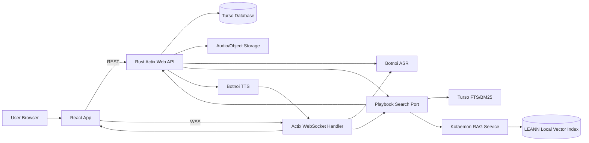

# Technical Architecture: SaleSync MVP

## 1. Architecture Summary

SaleSync MVP ใช้ Rust + Actix Web เป็น backend หลัก, React เป็น frontend, Turso เป็น database, Botnoi ASR/TTS สำหรับ voice capability และ WSS สำหรับ voice Senario

Knowledge/Playbook retrieval เริ่มจาก Turso FTS/BM25 เพื่อคุม source governance และ latency แต่ architecture ต้องรองรับ optional local RAG provider โดยใช้ Kotaemon เป็น RAG management/service layer และ LEANN เป็น local/private vector index backend ผ่าน `PlaybookSearchPort`

Frontend runtime ใช้ React Router สำหรับ routing, `path-to-regexp` สำหรับ route path builder, Zustand สำหรับ client state, `zod` สำหรับ schema validation ใน API/mock boundary, `radash` สำหรับ utility helper, `react-icons` สำหรับ icon และ React Portal สำหรับ modal/drawer/overlay

MVP input มี 3 แบบ:

- **Batch Quality Review**: สร้าง batch จากไฟล์เสียง เอกสาร หรือบทความ เพื่อถอดเสียง/normalize text และประเมินด้วย guidance เดียวกัน
- **Recording Review Training**: sales อัดเสียงใน browser หรืออัปโหลดไฟล์เสียงเป็น attempt ใน batch เพื่อประเมินด้วย training rubric และดูพัฒนาการครั้งที่ 1, 2, 3
- **Voice Senario**: stream เสียงผ่าน WSS เพื่อคุยกับ AI แบบโต้ตอบ

## 2. System Diagram



## 3. Rust/Actix Web Module Structure

Backend structure ต้องตาม [backend-architecture-standard.md](./backend-architecture-standard.md) โดยยึด pattern DDD + Clean Architecture จาก repo `Rayato159/quests-tracker` และปรับ HTTP adapter เป็น Actix Web

```text
src/
  main.rs
  lib.rs
  config/
  domain/
    entities/
    repositories/
    value_objects/
  application/
    usecases/
  infrastructure/
    actix_http/
      routers/
    turso/
      repositories/
    storage/
    botnoi/
    playbook_search/
    jwt_authentication/
migrations/
tests/
  integration/
```

## 4. Core Backend Responsibilities

| Module | Responsibility |
|---|---|
| `quality-review-batches` | batch lifecycle, batch item queue, async sequential processing |
| `audio-submissions` | รับ metadata, upload status, processing lifecycle |
| `storage` | เก็บและอ่านไฟล์เสียงและเอกสารต้นฉบับ |
| `document_processing` | validate `.md`, `.txt`, `.doc`, `.docx`, extract/normalize text และสร้าง evidence spans |
| `botnoi` | wrapper สำหรับ Botnoi ASR/TTS |
| `transcripts` | เก็บ utterance, timestamp, speaker, confidence |
| `rules` | required rule, prohibited phrase, semantic rule config |
| `scorecards` | rubric, scoring result, evidence, override |
| `playbooks` | playbook metadata, section management, approval status, promotion validity |
| `playbook_search` | provider port สำหรับ Turso FTS/BM25, Kotaemon/LEANN local RAG, source snippet, citation, abstention policy |
| `rag_indexing` | sync approved Playbook Sections หรือ normalized documents เข้า local RAG index พร้อม mapping กลับ source id |
| `voice-sessions` | WSS session, turn state, audio event, transcript event |
| `training` | recording review batch, attempt comparison, Senario result, pitch feedback |
| `onboarding` | path, module, progress, sign-off |
| `audit` | user action และ system event log |

## 5. Turso Data Tables เบื้องต้น

| Table | Key Fields |
|---|---|
| `users` | id, name, email, role, team_id, status |
| `sales_profiles` | user_id, sales_code, product_line, region, language, readiness_status |
| `teams` | id, name, manager_id |
| `quality_review_batches` | id, user_id, scorecard_id, title, source_type, topic, status, total_items, completed_items, failed_items |
| `quality_review_batch_items` | id, batch_id, audio_submission_id, source_type, file_name, mime_type, file_size_bytes, storage_uri, normalized_text_uri, status, sort_order, score, error_code |
| `recording_review_batches` | id, user_id, created_by_user_id, scorecard_id, title, input_mode, scenario, status, total_attempts, completed_attempts, latest_score |
| `recording_review_attempts` | id, batch_id, audio_submission_id, recorded_by_user_id, source_type, file_name, mime_type, storage_uri, status, sort_order, score, feedback_json |
| `audio_submissions` | id, user_id, type, product, scenario, status, storage_uri, duration_sec |
| `transcript_utterances` | id, submission_id, speaker, start_ms, end_ms, text, edited_text, edited_by_user_id, edited_at, confidence |
| `scorecards` | id, name, type, version, status |
| `scorecard_sections` | id, scorecard_id, label, sort_order, weight, status |
| `scorecard_results` | id, submission_id, scorecard_id, total_score, status, reviewed_by |
| `score_items` | id, result_id, rule_id, score, evidence_text, start_ms, end_ms |
| `rules` | id, scorecard_id, section_id, label, type, severity, sort_order, weight, expected_evidence, example, config_json, status |
| `playbooks` | id, title, owner_id, product, version, status, effective_date, expiry_date |
| `playbook_sections` | id, playbook_id, section_type, title, question, short_answer, detailed_answer, tags_json, effective_date, expiry_date, status, search_text |
| `playbook_rag_indexes` | id, provider, source_type, source_id, external_document_id, external_chunk_id, indexed_at, status |
| `playbook_chat_sessions` | id, user_id, title, product, customer_segment, language, status, created_at, updated_at |
| `playbook_messages` | id, session_id, user_id, question, answer, citations_json, abstained, feedback, created_at |
| `voice_sessions` | id, user_id, persona, scenario, status, started_at, ended_at |
| `voice_turns` | id, session_id, speaker, text, audio_uri, started_at |
| `voice_response_latency_events` | id, session_id, ai_turn_id, user_id, action, latency_ms, captured_at |
| `training_results` | id, user_id, session_id, submission_id, recording_review_batch_id, recording_review_attempt_id, type, score, summary_json |
| `onboarding_paths` | id, title, version, status |
| `onboarding_modules` | id, path_id, title, type, required_score |
| `progress` | id, user_id, module_id, status, score, completed_at |
| `audit_logs` | id, actor_id, action, entity_type, entity_id, payload_json, created_at |

## 6. REST API Draft

| Method | Path | Purpose |
|---|---|---|
| `POST` | `/audio-submissions` | create upload record and metadata |
| `POST` | `/audio-submissions/:id/file` | upload audio file |
| `POST` | `/audio-submissions/:id/process` | start ASR/scoring job |
| `GET` | `/audio-submissions/:id` | get submission detail |
| `GET` | `/audio-submissions/:id/transcript` | get transcript |
| `GET` | `/audio-submissions/:id/scorecard` | get score result |
| `GET` | `/quality-scorecards/templates` | list scorecard templates by topic/customer segment/product |
| `PATCH` | `/scorecard-results/:id/override` | manager override |
| `POST` | `/playbooks` | create playbook |
| `POST` | `/playbooks/:id/sections` | create playbook section |
| `PATCH` | `/playbook-sections/:id/publish` | publish section |
| `POST` | `/playbook-chat-sessions` | create Ask chat session |
| `GET` | `/playbook-chat-sessions` | list Ask chat sessions |
| `GET` | `/playbook-chat-sessions/:id` | get Ask session with messages and citations |
| `POST` | `/playbook-chat-sessions/:id/messages` | ask playbook-guided question in a session |
| `POST` | `/playbook-messages/:id/feedback` | save answer feedback |
| `POST` | `/playbook-indexes/sync` | admin/internal sync approved Playbook source to local RAG provider |
| `GET` | `/playbook-indexes/status` | inspect BM25/Kotaemon/LEANN indexing state |
| `POST` | `/recording-review-batches` | create training recording batch |
| `GET` | `/recording-review-batches` | list training recording batches |
| `GET` | `/recording-review-batches/:id` | get batch attempts, trend and rubric result |
| `PATCH` | `/recording-review-batches/:id` | rename/update recording review batch metadata |
| `POST` | `/recording-review-batches/:id/attempts` | add browser recording or uploaded audio attempt |
| `POST` | `/recording-review-batches/:id/run` | process queued attempts sequentially |
| `GET` | `/recording-review-attempts/:id/transcript` | get ASR utterances for attempt review modal |
| `PATCH` | `/recording-review-attempts/:attemptId/transcript-utterances/:utteranceId` | correct ASR utterance text while preserving raw ASR text |
| `GET` | `/training-rubrics` | list scorecard templates where type is training rubric |
| `GET` | `/training-rubrics/:id` | get training rubric detail for editor |
| `PATCH` | `/training-rubrics/:id` | update training rubric draft metadata/sections/rules |
| `GET` | `/onboarding/users/:id/progress` | get user progress |
| `POST` | `/onboarding/modules/:id/complete` | mark module completed |

## 7. WSS Event Draft

Endpoint: `/ws/voice-sessions`

| Direction | Event | Payload |
|---|---|---|
| client to server | `session.start` | persona, scenario, product, language |
| client to server | `audio.chunk` | binary audio chunk or base64 chunk metadata |
| client to server | `response_latency.recorded` | session_id, ai_turn_id/message_key, action, latency_ms, captured_at |
| client to server | `session.end` | reason |
| server to client | `session.ready` | session_id |
| server to client | `asr.partial` | text, confidence |
| server to client | `asr.final` | turn_id, text |
| server to client | `ai.text` | turn_id, text |
| server to client | `tts.audio` | turn_id, audio_url or audio chunk |
| server to client | `session.summary` | score, feedback, next_steps |
| server to client | `error` | code, message, retryable |

`response_latency.recorded` เป็น hidden analytics event ของ Senario session ไม่ต้องแสดงใน UI ผู้ใช้ โดยวัดเวลาตั้งแต่ AI/persona response ถูกส่งถึง frontend จน user เริ่มพิมพ์, กด push-to-talk หรือกดส่งข้อความ ใช้เพื่อวิเคราะห์ hesitation, confidence และ coaching opportunity หลัง session

## 8. Processing Flow: Quality Review Batch

1. User creates a quality review batch with metadata and selected guidance/scorecard template
2. User adds audio/document/article items into the batch
3. Backend validates supported formats and stores item metadata with file/document pointers
4. User starts batch run
5. Backend marks batch `processing` and processes items sequentially in FIFO order
6. For audio item, backend sends file to Botnoi ASR and stores transcript utterances
7. For document/article item, backend accepts `.md`, `.txt`, `.doc`, `.docx`, extracts/normalizes text and stores document evidence spans
8. Scorecard engine evaluates each item against selected rubric/guidance
9. Backend stores score result, score items, evidence and item status
10. UI shows only batch summary in list; user opens batch detail to see per-item progress/result

## 9. Processing Flow: Voice Senario

1. User starts WSS session
2. Frontend streams audio chunk
3. Actix WebSocket handler forwards audio to Botnoi ASR
4. Final ASR turn is sent to scenario engine
5. Scenario engine creates AI customer response using preloaded playbook sections or scripted scenario context
6. Backend calls Botnoi TTS
7. Frontend plays TTS response
8. Session summary is generated after end

## 10. Processing Flow: Recording Review Training

1. Sales creates a recording review batch and selects a training rubric
2. Sales chooses input mode:
   - `browser_recording`: frontend records microphone audio and uploads the saved recording as an attempt
   - `audio_upload`: frontend uploads one or more existing audio files as attempts
3. For browser recording, frontend saves stopped audio as a draft attempt first and asks whether to send it to queue now; draft attempts must not call Botnoi ASR
4. Backend validates file type, stores audio, and inserts `recording_review_attempts` with `sort_order` and status `draft` or `queued`
5. User may rename batch metadata before or after attempts are added; backend keeps audit trail for metadata updates
6. User starts batch run
7. Backend processes queued attempts sequentially
8. Backend sends attempt audio to Botnoi ASR and stores transcript utterances
9. Score engine evaluates transcript against `scorecards.type = training_rubric`
10. Backend stores score result, feedback summary, evidence and attempt score
11. Batch latest score and completed attempt count are updated
12. UI shows attempt trend so sales/manager can compare attempt 1, 2, 3
13. User can open an attempt review modal to inspect playback, ASR transcript, SRT-style timestamps and speaker turns

Supported audio formats for MVP: `.mp3`, `.wav`, `.m4a`, `.webm`

## 11. Security Requirements

- JWT/session auth for REST and WSS
- role guard for sales, manager and admin action
- audit log for upload, override, playbook publish/expire, onboarding sign-off
- secrets in environment variables or secret manager
- audio retention policy
- PII redaction before broad dashboard display
- signed URL or controlled proxy for audio access

## 12. Implementation Notes

- Do not hardwire PBX assumptions into the MVP data model
- Treat `AudioSubmission` as the main abstraction instead of `Call`
- Treat Recording Review attempts as training artifacts, not customer calls; they may reuse `audio_submissions` for storage/transcript but must be grouped by `recording_review_batches`
- Keep Botnoi client behind service interface so provider can be swapped later
- Treat document review as the same batch/item pipeline as audio review; only the preprocessing adapter changes from ASR to text extraction/normalization
- MVP document formats are `.md`, `.txt`, `.doc`, `.docx`; later Google Docs/Drive integration should import/export into the same document item contract
- MVP playbook flow should use Turso full-text search/BM25 first for stability, then add Kotaemon/LEANN as optional local RAG provider behind `PlaybookSearchPort`
- Kotaemon/LEANN must not become the source of truth for pricing, promotion, policy or compliance. SaleSync/Turso Playbook remains source of truth and backend must filter effective/expiry/status after retrieval.
- Voice Senario should preload retrieval context before or between turns; do not run heavy RAG retrieval on every audio chunk.
- Store raw audio separately from transcript and score data
- Keep WSS events versioned enough to evolve without breaking frontend

## 13. Frontend/Backend Boundary

| Capability | Frontend Responsibility | Backend Responsibility |
|---|---|---|
| Quality review batch | create batch, add items, choose guidance, show batch list and detail state | own batch/item lifecycle, sequential async processing, retry, persist item results |
| Audio upload | validate file type/size for UX, upload file, show progress inside batch detail | validate again, store file, call Botnoi ASR, persist transcript |
| Document/article review | collect text/document input and display evidence spans | extract/normalize document text, run rubric, persist evidence spans |
| Recording review batch | create batch, choose input mode/rubric, record or upload attempts, show attempt trend | own batch/attempt lifecycle, sequential async processing, persist score trend and feedback |
| Training rubric | render rubric list and validation test table | expose `training_rubrics`, version rubric, enforce published/draft permission |
| Voice Senario | record microphone, send audio chunks over WSS, play TTS audio, show session state | own WSS protocol, call Botnoi ASR/TTS, maintain conversation state, persist session |
| Playbook | render search UI, display sections/citations, collect feedback | query PlaybookSearchPort via BM25 or Kotaemon/LEANN, filter status/effective/expiry, compose guided answer |
| Persona/scenario | let user select persona/scenario | preload persona, scenario and playbook sections, enforce behavior rules |
| Scoring | display score/evidence, submit manager override | run rule engine, calculate score, store evidence and audit log |
| State | keep transient UI state in Zustand | keep source of truth in Turso |

Boundary rules:

- Frontend must not call Botnoi directly.
- Frontend must not query Turso directly.
- Frontend must not decide whether a playbook promotion is valid.
- Backend must treat all frontend validation as advisory and validate again.
- WSS event contract is shared, but session state belongs to backend.
