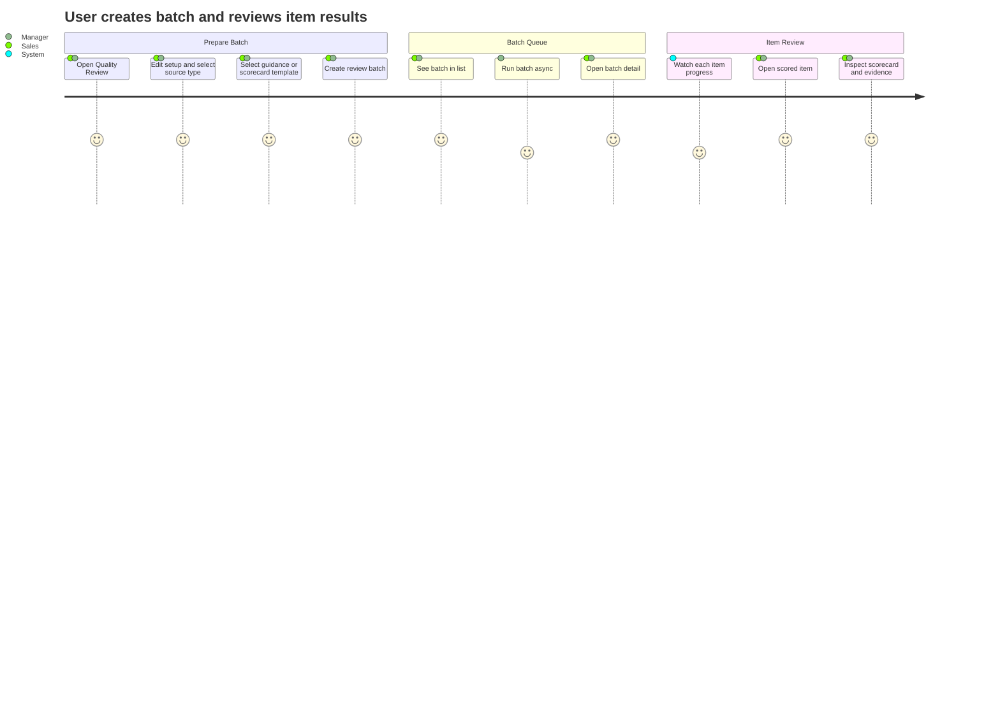
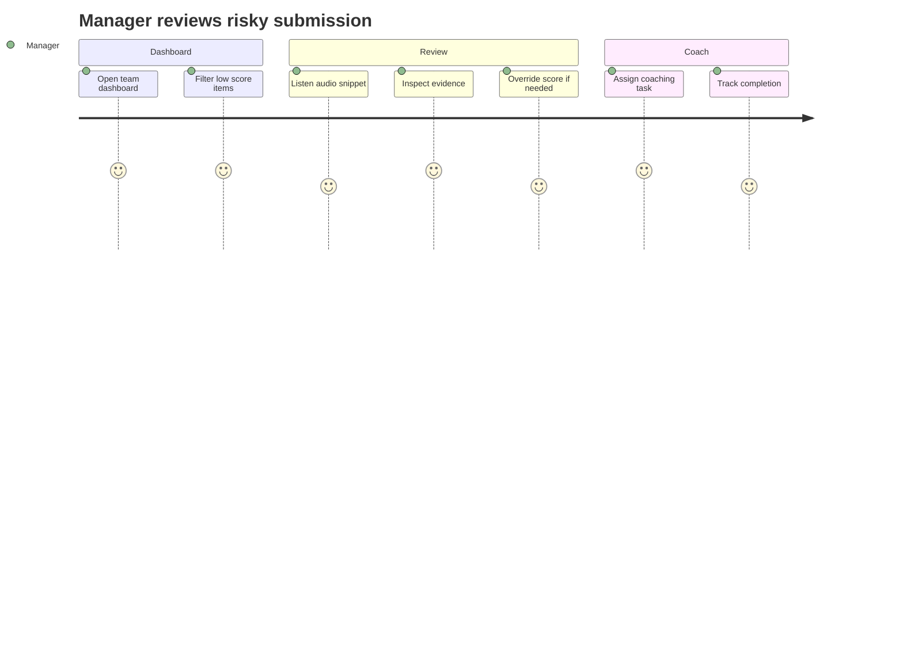
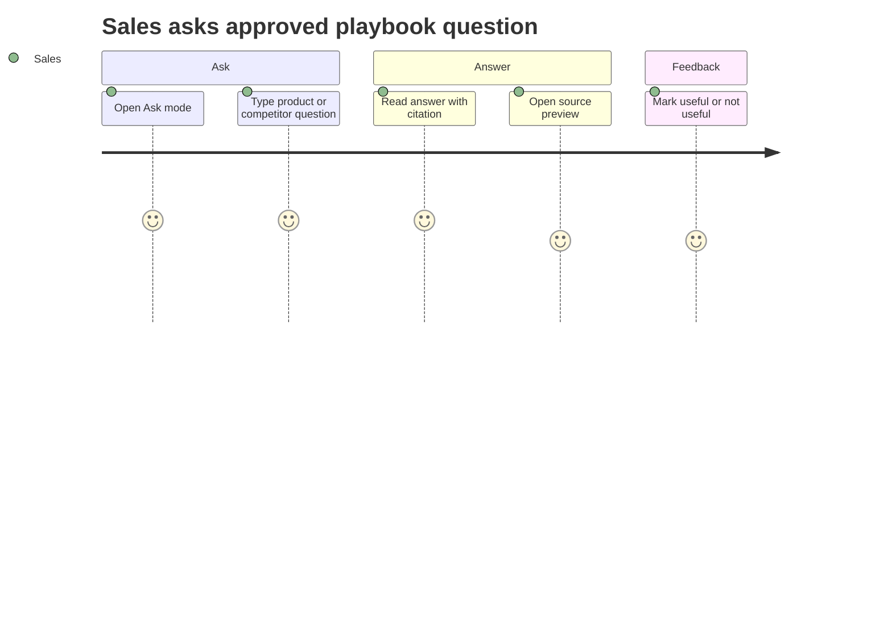
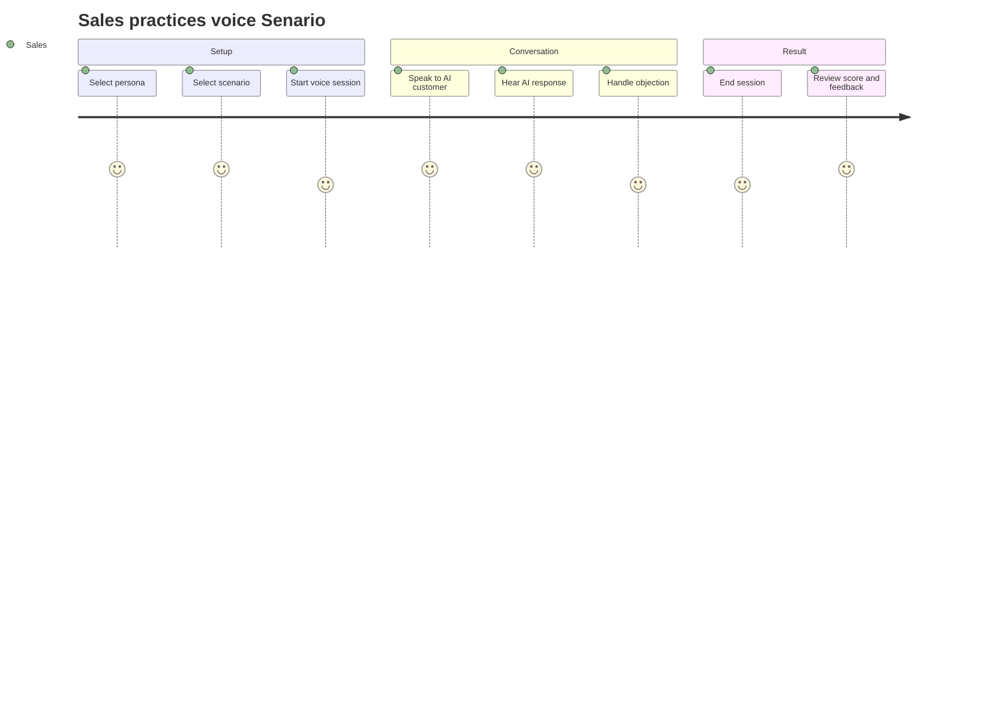
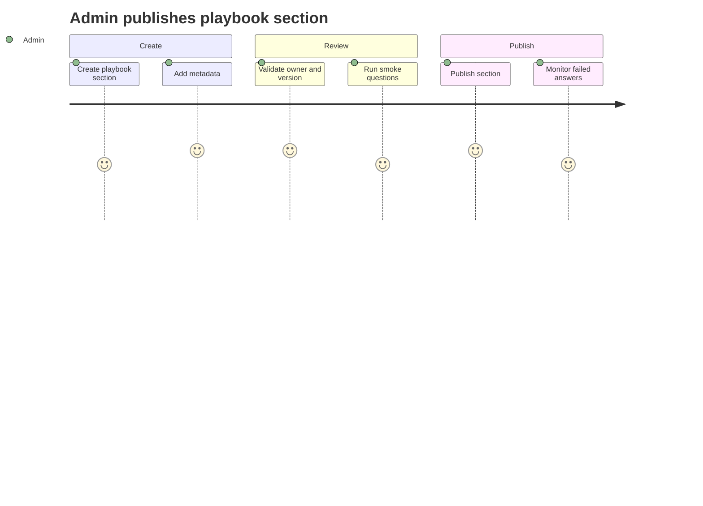
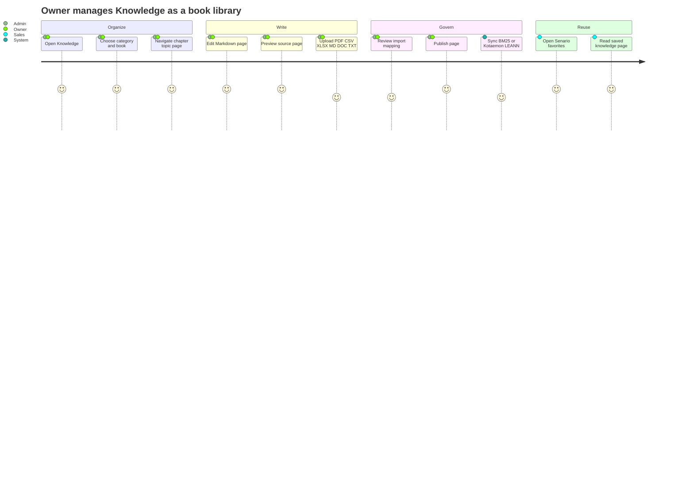
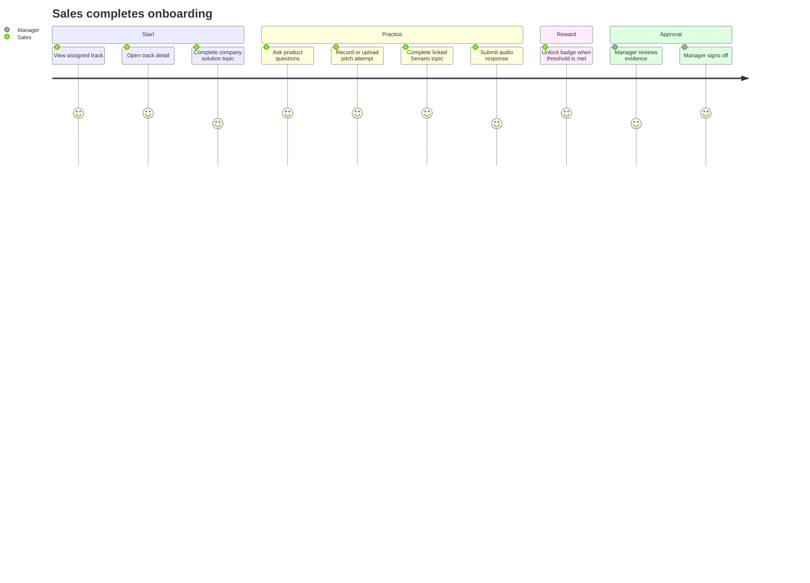

# User Journeys

## 1. Sales/Manager: Create Batch Quality Review

### Flow

1. User เปิดหน้า `Quality Review`
2. กด `Edit setup` เพื่อเลือก source type, metadata และ guidance/scorecard template
3. สร้าง review batch จากไฟล์เสียง เอกสาร หรือบทความหลายรายการ โดย document รองรับ `.md`, `.txt`, `.doc`, `.docx`
4. หน้า list แสดง batch summary เท่านั้น
5. User กด run batch เพื่อให้ backend process item ทีละรายการแบบ async
6. User ต้องกดเข้า batch detail ก่อนจึงเห็น progress และ result รายไฟล์หรือราย document
7. เมื่อ item scored แล้ว user เปิด scorecard, transcript/document evidence และ recommendation ได้

## 2. Manager: Review Low Score Submission

### Flow

1. Manager เปิด dashboard
2. filter batch หรือ item ที่ score ต่ำหรือมี critical flag
3. เปิด batch detail แล้วเลือก item เพื่อดู transcript/evidence
4. override score หาก AI ประเมินผิด
5. assign coaching task
6. track completion ใน onboarding dashboard

## 3. Sales: Ask Playbook Search

### Flow

1. Sales เปิด `Training > Ask`
2. ถามคำถามเกี่ยวกับ product, use case, competitor หรือ objection
3. ระบบค้นจาก published playbook sections ที่ยังไม่หมดอายุ
4. AI ตอบพร้อม citation
5. Sales เปิด source preview ได้
6. หากคำตอบไม่ดี sales ให้ feedback เพื่อให้ admin ปรับ playbook

## 4. Sales: Voice Senario

### Flow

1. Sales เลือก persona เช่น price-sensitive customer
2. Frontend เปิด WSS session
3. Sales พูดผ่าน microphone
4. Backend ส่งเสียงไป Botnoi ASR
5. AI scenario engine สร้างคำตอบ
6. Backend ส่งข้อความไป Botnoi TTS
7. Frontend เล่นเสียงตอบกลับ
8. จบ session แล้วระบบสรุป score และ feedback

## 5. Admin: Publish Playbook Section

### Flow

1. Admin สร้าง playbook section
2. กำหนด owner, version, section type, effective date, expiry date และ tags
3. section อยู่สถานะ draft/review
4. run smoke eval ด้วยคำถามพื้นฐาน
5. publish section
6. Guided Q&A ใช้ section เป็น approved source เมื่อยังไม่หมดอายุ

## 5.1 Admin/Owner: Manage Knowledge Library

### Flow

1. Owner เปิดหน้า `Knowledge`
2. เลือก category เช่น product, sales playbook, market intelligence หรือ battlecard
3. เลือก book แล้วเจาะเข้า chapter, topic และ page
4. เขียนหรือแก้เนื้อหาใน Markdown editor พร้อม preview
5. Upload resource ได้ทั้ง `.pdf`, `.csv`, `.xlsx`, `.md`, `.doc`, `.docx`, `.txt`
6. ระบบสร้าง import job, extract text และให้ owner map เข้า page ก่อน publish
7. เมื่อ publish แล้ว backend queue BM25 index และ optional Kotaemon/LEANN sync
8. Sales เห็น favorite จาก Senario/session review ในหน้า Knowledge เพื่ออ่านต่อภายหลัง

## 6. Sales Onboarding Journey

### Flow

1. Manager/admin สร้าง track ใน Track Management
2. Manager assign track ให้ sales หรือทีม
3. Sales หรือ manager filter track ตาม category, level และ solution เช่น Foundation, Beginner, Chatbot
4. Sales เปิด `track/:id` เพื่อดู topic, progress และ badge criteria
5. Sales ทำ topic แบบ Knowledge หรือ External View เพื่ออ่านเอกสาร/แหล่งอ้างอิง
6. Sales ทำ topic แบบ Audio Response โดยฟังโจทย์แล้วเขียนคำตอบให้ AI/manager ประเมิน
7. Sales สร้าง recording review batch
8. Sales เลือก training rubric
9. Sales อัดเสียงใน browser หรือ upload ไฟล์เสียงเป็น attempt
10. ระบบประเมิน attempt ด้วย rubric และแสดง score/feedback
11. Sales ทำ voice Senario หรือ Meeting Room ที่ผูกกับ track
12. เมื่อ Senario complete และ score ผ่าน threshold ระบบ mark topic เป็น completed
13. ระบบคำนวณ track percent และ unlock badge เมื่อ complete ตาม threshold
14. Manager เปิด progress/evidence เพื่อ sign-off readiness

Admin settings journey:

1. Admin เปิด Settings
2. Admin เข้า Track Categories เพื่อเพิ่ม/แก้/ลบ category และดู track ที่ assign อยู่
3. Admin เข้า Solutions เพื่อเพิ่ม/แก้/ลบ solution catalog เช่น Chatbot, Voicebot, Digital Human, CMS, DocSearch
4. เมื่อกด delete ระบบแสดง confirm modal yes/no ก่อนลบทุกครั้ง
